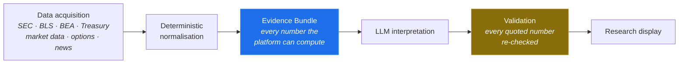
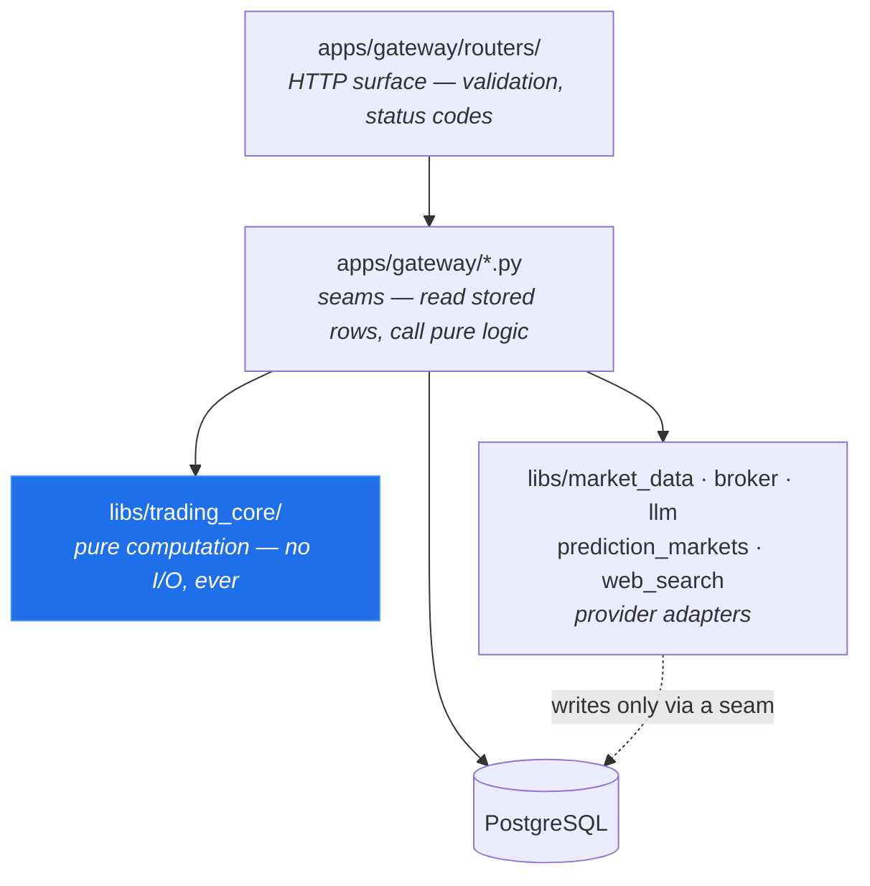
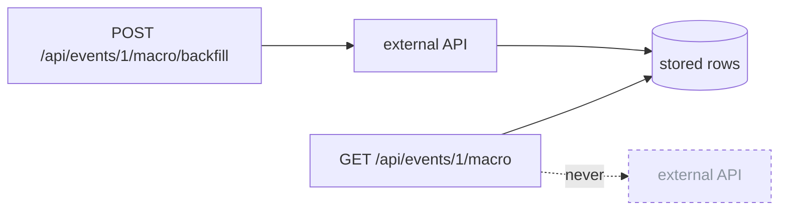
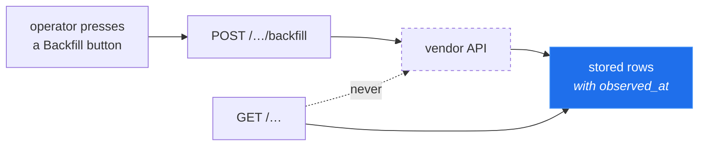

# trading-system-with-ai — backend

> ## ⚠️ Research software. Not financial advice.
>
> This project analyses market data and writes research notes. **It is not a
> recommendation to buy or sell anything**, it is not financial, investment,
> legal or tax advice, and its authors are not registered investment advisers.
>
> **Options trading carries a substantial risk of loss** and is not suitable
> for every investor. Nothing here has been reviewed by any regulator.
> Backtested results do not predict future returns, and this software may
> contain defects that produce wrong numbers.
>
> **If you connect a broker, you are placing the trades and you bear the
> losses.** Execution ships disabled (`TRADING_ENABLED=false`) and every order
> requires explicit human approval. Turning those safeguards off is a decision
> you make alone.
>
> Licensed under [Apache 2.0](LICENSE) and provided **"AS IS", without
> warranties or conditions of any kind**. Full text: [NOTICE](NOTICE).

---

A research platform for **options trading around scheduled catalysts** —
earnings, CPI, GDP, FOMC decisions. It gathers evidence from primary sources,
computes what it can deterministically, asks a language model to interpret only
what is left, and then checks the model's arithmetic against its own numbers.

It does not decide what to trade. It assembles the case, shows its work, and
leaves the decision to you.

This repository is the **backend**: FastAPI gateway, deterministic
trading/risk engine, and the provider adapters that reach the outside world.
Python 3.12+, PostgreSQL, Redis. The frontend lives in a separate repository —
see [Running the full stack](#running-the-full-stack).

## The idea

Most "AI trading" projects hand a language model a prompt and a brokerage key.
This one is built on the opposite premise: **a language model is very good at
reading and very bad at being trusted**, so it is given the reading and denied
the trust.



The Evidence Bundle is the contract. It is computed before any model runs, it
is what the model is given, and it is served to the UI whether or not a model
ever ran. If the LLM is unconfigured or fails, every endpoint still answers —
you lose the prose, not the facts.

**Validation is not advisory.** After the model writes its note, every number
it quoted is looked up in the bundle's fact index. A number the platform never
computed is a violation, and violations are stored and displayed rather than
silently dropped.

### What the model may and may not do

| The model MAY | The model MAY NOT |
|---|---|
| interpret evidence, weigh conflicts, write the narrative | compute a number, or quote one not in the bundle |
| plan search queries; pick which prediction-market event fits | choose date boundaries, rate limits, or network destinations |
| classify semantic relevance among supplied candidates | invent a source, a market, a price or an id |
| say "the evidence does not support a view" | reach instrument selection, sizing, gating, or execution |

There is **no tool-calling and no browsing agent**. The model receives text and
returns text.

### Safety model

Four independent layers, each crossed deliberately:

1. **`TRADING_ENABLED=false` by default** — a kill switch, off until you turn
   it on.
2. **Human approval per order.** No path places an order without it.
3. **A gate chain** that must return PASS before an order is even offered.
4. **Research isolation.** Web search and prediction markets are structurally
   incapable of influencing instrument selection, sizing, gating or exits.

The prediction-market subsystem is **read-only by construction**: no wallet, no
signing key, no order, no position — the provider protocol has no method that
could place one and the schema has no column that could hold one. A word-ban
test fails the build if a trading-shaped function name appears there.

### Honesty rules

Enforced in code rather than urged in a style guide:

- **Absent is not zero.** An unreported spread and a zero spread are opposite
  claims; the first serialises as `null` and renders as "unknown".
- **Every empty state is named.** "Nobody researched this yet", "we looked and
  found nothing", "the venue was unreachable" and "not configured" are four
  different answers, never one blank field.
- **No timestamp is invented.** If a source did not state when something
  happened, the field is null.
- **A price is what a contract costs**, never "the probability of an outcome".
- **Partial data is labelled partial.** A distribution whose brackets don't sum
  to ~100¢ is missing some, and says so.

---

## Layering, and the one rule that holds it together



**`libs/trading_core/` performs no I/O.** It takes values and returns values —
no HTTP client, no database session, no clock it did not receive as an
argument. This is enforced by an AST test, not by convention, and it is what
makes several thousand tests fast and deterministic.

A **seam** (`apps/gateway/event_price.py`, `event_macro.py`, …) is the only
place the two halves meet: it loads stored rows, converts them to the pure
layer's value types, calls a pure function, and renders the frozen result as
JSON. Seams compute nothing themselves.

## Reads never fetch



A GET is answerable from the database alone. Only an explicit `POST …/backfill`
spends a request against a vendor. This is not a performance choice — BLS's
unregistered API allows roughly 25 requests per day, so a read endpoint that
lazily topped up would exhaust the daily budget on one page load and then
serve errors to everybody, including the backfill that could have fixed it.

It also makes every read **point-in-time**: pass `as_of` and you get the answer
that would have existed then, because nothing can arrive mid-request.

## Background loops

Six asyncio tasks start with the process and stop with it. Each is disabled by
setting its interval to `0`.

| Loop | Default | What it does |
|---|---|---|
| `order_sync` | 30s | settles non-terminal orders against the broker's own state |
| `monitor` | 300s | scans positions for exit conditions |
| `reconciliation` | 300s | compares ledgers; a material mismatch **pauses trading** via the kill switch |
| `risk_snapshot` | 1800s | writes one NAV snapshot per trading day (the drawdown baseline) |
| `event_calendar` | 3600s | ingests release calendars and fires T-minus alerts |
| `market_stream` | continuous | one websocket for quotes, replacing per-poll REST calls |

Two properties worth stating because they are easy to assume wrongly:

- **None of them calls an LLM.** Every model call in this platform is a POST
  you triggered. A loop that could invoke a model on its own would be an agent,
  and this is not one.
- **Only reconciliation can touch execution, and only toward safety** — it can
  pause trading, never start it.

## Provider registries

Every provider family has the same shape: a `Protocol`, a `_PROVIDERS` dict,
and `get_provider(name)`.

| Family | Implementations |
|---|---|
| `market_data` | alpaca (+ stream), massive, stub |
| `broker` | alpaca (paper/live) |
| `llm` | openai, anthropic, stub |
| `prediction_markets` | polymarket, stub |
| `web_search` | brave, stub |

Three rules that recur because each was learned the hard way:

- **No default provider.** An unset name raises rather than quietly picking one.
- **No cross-provider fallback.** If the configured vendor fails, that is the
  answer. Silently serving another vendor's numbers under the first one's name
  is how two pages come to disagree about the same instrument.
- **`ProviderNotConfigured` ≠ `ValueError`.** "You have not set this up" and
  "that provider does not exist" are different problems with different fixes.

Stubs are **opt-in only**, never a fallback. A stub that activates on failure
turns an outage into plausible fake data.

## Database

### Why store anything at all?

A reasonable first question: if the platform only reads public data, why not
fetch it on demand and keep nothing?

Four reasons, in order of how much they matter:

1. **Point-in-time correctness.** The platform's central claim is that it can
   answer "what did we know on 2026-06-25?" without hindsight. That is only
   possible if observations are *stored with the instant they were observed*.
   A live fetch can only ever tell you about now, so a backtest built on live
   fetches silently uses tomorrow's revisions to judge yesterday's decision —
   the classic look-ahead bug.
2. **Vendors do not keep the history you need.** BLS's unregistered API serves
   roughly three years and silently truncates a wider ask. Polymarket's price
   history is span-capped per request. A revised GDP figure overwrites the
   original at the source. If you did not store it when you saw it, it is gone.
3. **Rate limits are strict.** BLS allows ~25 requests/day unregistered.
   Loading one event page touches a dozen data families; without storage, one
   page view would exhaust a day's budget for everyone.
4. **Reproducibility.** A stored bundle plus a stored analysis means you can
   see exactly which numbers produced a conclusion, months later. That is what
   makes the validator's "this number is not in the bundle" check meaningful.

### How data gets in and out

Two rules cover the whole lifecycle, and they are the same two rules the
"Reads never fetch" section above describes:



- **Research data is written only when you ask.** Every path that stores
  prices, news, filings, option chains or prediction-market history is a
  `POST …/backfill` or `POST /api/events/refresh` behind a button. There is no
  lazy top-up on read, so nothing accumulates while you are not looking.
- **Reading never fetches.** Opening an event page issues ordinary GETs that
  answer from stored rows alone. If nothing was backfilled, the page says so
  per panel — it does not silently go fetch.

Six background loops DO run (see [Background loops](#background-loops)), but
none of them fetches research data on its own: five read and write local rows
or talk to your broker, and only the event-calendar loop reaches an outside
source — the public release calendars.

So the answer to "do I have to save and call it manually?" is: **saving is
manual, reading is automatic.** That split is deliberate — it is what keeps a
page view from spending your API quota, and it is why an unconfigured install
still renders every page.

### Will it explode?

Measured on a real install after months of use: **22 MB total.**

| Table | Rows | Size | Grows with |
|---|---|---|---|
| `prediction_market_history` | 27,000 | 2.9 MB | ~265 daily points per contract, once |
| `stock_bars_daily` | 5,000 | 0.9 MB | ~250 rows per ticker per year |
| `news_articles` | 480 | 0.8 MB | articles you backfill |
| `audit_events` | 708 | 0.6 MB | actions you take |
| `events` | 324 | 0.5 MB | ~50 macro releases + earnings per quarter |

Daily bars are tiny. Measured at ~180 bytes/row, a ticker costs ~250 rows per
year, so **a hundred tickers for a decade is ~250k rows ≈ 45 MB**.
Prediction-market history runs ~110 bytes/row and is bounded by contract count:
each contract's history is fetched once and thereafter only extended.

**The one table that could grow fast is `stock_bars_1m`** (minute bars, a
TimescaleDB hypertable): one trading day of one ticker is ~390 rows, so a year
of one ticker is ~98k rows ≈ 18 MB — an order of magnitude more per ticker than
daily bars. It is deliberately kept near-empty — minute bars are
fetched only by an explicit "backfill minute bars (last 4 events)" button,
bounded to a handful of event windows, never for a whole history.

**There is no automatic retention policy.** If you backfill minute bars
aggressively you will grow this table without bound, and pruning it is
currently your job:

```sql
DELETE FROM stock_bars_1m WHERE ts < now() - interval '1 year';
```

For a personal research install this has not been necessary. If you run it
continuously across many tickers, add a TimescaleDB retention policy on that
hypertable.

### Migrations

`migrations/` holds the schema: hand-numbered idempotent SQL.

**There is no migration runner.** The files are mounted into the Postgres
container's entrypoint, which runs them *only on a fresh volume* — so a brand
new install gets the whole schema automatically, and an existing database is
never altered behind your back. Applying one to a live database is a manual,
deliberate act:

```bash
docker exec -i services-db-1 psql -U trading -d trading < migrations/0NN_thing.sql
```

Every statement is `IF NOT EXISTS` / re-runnable, so applying a file twice is
harmless. `tests/test_migration_parity.py` pins the SQL against the ORM —
column names *and order* — so a model that drifts from its migration fails the
build rather than failing at runtime.

## Runtime configuration

Provider names and API keys live in the `runtime_config` **table**, not in
`.env`, so they can be changed from `/settings` without a redeploy. The config
API returns **booleans, never values** (`"configured": true`), and the logging
layer redacts any key matching `api_key|secret|password|token|authorization`.

`.env` carries only what must exist before the database does: the database URL
itself, Redis, the port, and the SEC contact User-Agent.

## Layout

```
apps/gateway/
  routers/          HTTP endpoints, one module per resource — validate input,
                    call one function, return a status code
  execution/        the trading decision, independent of HTTP:
                    gate_chain.py is the full PASS/FAIL chain
  *.py              seams: event_price, event_macro, event_news,
                    event_evidence, event_research, event_prediction_markets,
                    risk_*, broker_exec, order_sync, …
  db.py             SQLAlchemy models (mirror migrations/ exactly)
libs/
  trading_core/     PURE: events, risk, options, signals, backtest, exits
  market_data/ broker/ llm/ prediction_markets/ web_search/
  event_calendar/   SEC, BLS, BEA, Treasury, FOMC adapters
  common/           config, logging, telemetry
migrations/         numbered idempotent SQL
tests/              ~4500 tests
docs/               architecture notes, ADRs; docs/archive/ for history
```

## Quick start

Requirements: Docker, Python 3.12+.

```bash
cp .env.example .env      # defaults are safe: no providers, trading OFF
docker compose up -d      # Postgres, Redis, and the API on :8000
curl localhost:8000/api/config/providers
```

The platform boots with **no providers configured**, and that is a supported
state: every endpoint answers, each payload explains what it is missing, and
nothing fabricates a number to fill the gap. Configure providers from the UI's
Settings page, or by `POST /api/config/providers` — credentials are stored in
the database, not in `.env`.

If port 8000 is taken, set `GATEWAY_PORT` in `.env`.

### Running the full stack

The frontend is a separate repository. Clone it beside this one:

```bash
git clone https://github.com/trading-system-with-ai/services.git
git clone https://github.com/trading-system-with-ai/ui.git
cd services && cp .env.example .env && docker compose up -d
cd ../ui && npm install && cp .env.example .env.local && npm run dev
```

The UI expects the gateway at `NEXT_PUBLIC_API_BASE` (default
`http://localhost:8000`). The backend is fully usable without the UI — it is a
plain JSON API.

## Data sources

Primary sources are preferred over aggregators wherever possible:

| Source | Used for | Key needed |
|---|---|---|
| SEC EDGAR | filings, earnings dates | no (contact User-Agent required) |
| BLS / BEA / Treasury | CPI, PPI, GDP, PCE, yields | BEA key for some series |
| Polymarket | prediction-market pricing (read-only) | no |
| Market-data vendor | bars, quotes, option chains | yes |
| Broker | paper or live execution | yes |
| LLM vendor | interpretation only | yes |
| Brave Search | supplementary web research | yes |

Every one is optional. An unconfigured provider degrades its own endpoint and
nothing else.

**Identify yourself honestly.** `SEC_USER_AGENT` is sent to SEC EDGAR and the
statistical agencies, which require a real contact address. Set it to yours.

## API surface

`/api/events` (catalysts and all their research seams), `/api/market`,
`/api/watchlist`, `/api/recommendations`, `/api/risk`, `/api/portfolio`,
`/api/positions`, `/api/orders`, `/api/trading`, `/api/trading-pool`,
`/api/plans`, `/api/backtests`, `/api/income`, `/api/alerts`, `/api/audit`,
`/api/broker`, `/api/config`. Interactive docs at `/docs` when running.

## Testing

```bash
pytest -q                      # everything
pytest -q tests/test_events_macro_api.py
pytest -q -k "prediction"
```

Tests run against SQLite; production uses Postgres. Where behaviour differs
(`ON CONFLICT`, JSONB), the seam is written to the common subset and the
difference is noted in the test.

Beyond ordinary unit tests, several **structural** tests encode rules that
would otherwise erode:

| Test | Enforces |
|---|---|
| `test_events_macro.py::test_module_imports_no_io_layer` | the pure layer reaches no API |
| `test_migration_parity.py` | ORM matches SQL, column order included |
| `test_research_safety_adversarial.py` | research code cannot import execution code |
| `test_research_e2e_adversarial.py` | a prompt-injection payload run end-to-end moves no execution row |
| `test_pure_layer_boundary.py` | every module under `libs/trading_core/` reaches no I/O — walked, not hardcoded |
| `test_layering_boundary.py` | no NEW module depends on a router (a ratchet: known inversions are listed, and a fixed one must leave the list) |
| `test_api_version_header.py` | every response carries the wire contract's version |

## Documentation

- [`docs/ARCHITECTURE.md`](docs/ARCHITECTURE.md) — subsystem map and ADRs
- [`docs/data-source-architecture.md`](docs/data-source-architecture.md) — which vendor owns which fact
- [`docs/prediction-market-architecture.md`](docs/prediction-market-architecture.md) — read-only design, bracket series, LLM selection
- [`docs/search-architecture.md`](docs/search-architecture.md) — untrusted-text handling
- [`docs/event-research-orchestration.md`](docs/event-research-orchestration.md) — how a research run is planned
- [`docs/archive/specs/`](docs/archive/specs/) — the original design briefs;
  the best place to understand the constraints every rule descends from
- [`docs/archive/`](docs/archive/) — development history and audits

Module docstrings carry the reasoning. Most explain *why* a rule exists,
usually because something went wrong without it — if you change the behaviour,
change the comment that justified it.

## Contributing

Tests are the specification: `pytest -q` must be clean before submitting.

The codebase has a strong documentation culture — modules explain **why** a
rule exists, not merely what the code does, because most of these rules were
written after something went wrong. If you change a behaviour, change the
comment that justified it.

Two habits that this project has learned the hard way:

- **Verify against live data, not stubs.** Stub-green tests have repeatedly
  hidden real defects, because the stub encodes the same assumption the code
  does. For any new external integration, call the real API once and check the
  stored rows before declaring it done.
- **An empty state that looks reasonable is the hardest bug to see.** The
  honesty rules make a broken pipeline look like a truthful report of absence.
  If data is missing that obviously should exist, treat the emptiness itself as
  the bug.

## Security

Found a vulnerability? See [SECURITY.md](SECURITY.md) — please report
privately rather than opening a public issue.

**The gateway ships with no authentication.** It assumes localhost. Put your
own auth in front of it before exposing it to a network.

## License

[Apache 2.0](LICENSE). See [NOTICE](NOTICE) for the risk disclaimer.
