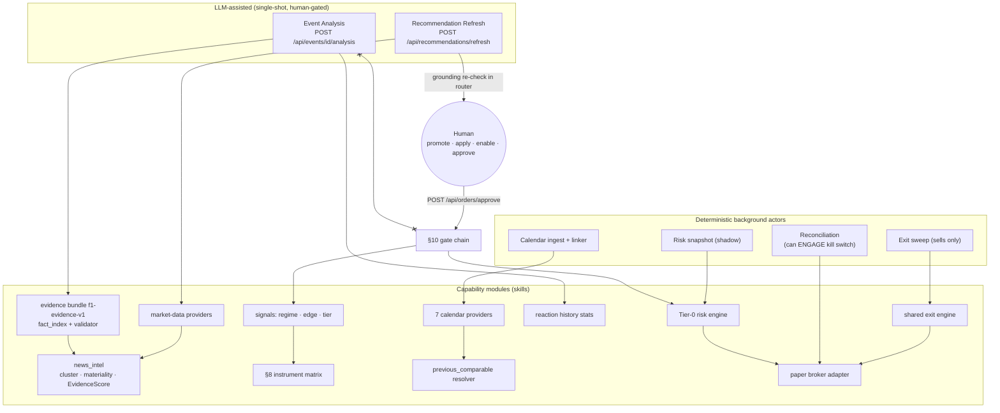
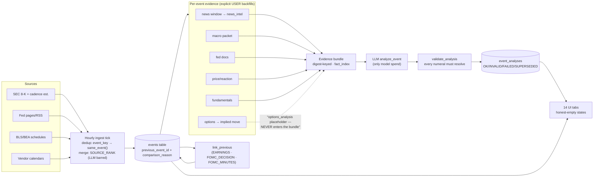

# CURRENT PLATFORM ARCHITECTURE

**Read-only architecture discovery & audit — implementation-grounded.**
Date: 2026-08-20 · Scope: entire repository (`services/` backend, `ui/` frontend, `prompts/` specs) · Method: direct source inspection + exhaustive greps; every claim cites `path::symbol` or `path:line`. Where documentation and implementation disagree, **implementation wins** and the mismatch is recorded (§31). No code was modified; this report is the only artifact.

---

## Table of Contents

1. [Executive Summary](#1-executive-summary)
2. [Repository Map](#2-repository-map)
3. [Runtime Topology & Infrastructure](#3-runtime-topology--infrastructure)
4. [Agent Inventory](#4-agent-inventory--everything-that-acts)
5. [Skills / Tools / Capability Inventory](#5-skills--tools--capability-inventory)
6. [Agent ↔ Capability Dependency Graph](#6-agent--capability-dependency-graph)
7. [LLM Architecture](#7-llm-architecture)
8. [Data-Driven Calculation vs LLM Judgment](#8-data-driven-calculation-vs-llm-judgment--the-boundary)
9. [Data Provider Inventory](#9-data-provider-inventory)
10. [Market Data Flows](#10-market-data-flows-stocks--options--fundamentals)
11. [Catalyst / Event System](#11-catalyst--event-system)
12. [Event Detail Tabs](#12-event-detail-tabs--per-tab-wiring)
13. [Historical / Comparable-Event Logic](#13-historical--comparable-event-logic)
14. [News Pipeline](#14-news-pipeline)
15. [Search Capabilities](#15-search-capabilities)
16. [Sentiment Systems](#16-sentiment-systems)
17. [Risk Architecture](#17-risk-architecture)
18. [Backtesting Architecture](#18-backtesting-architecture)
19. [Recommendation → Trading Lifecycle](#19-recommendation--trading-lifecycle)
20. [Human-in-the-Loop Inventory](#20-human-in-the-loop-inventory)
21. [Storage Architecture](#21-storage-architecture)
22. [Async / Background Processing & Messaging](#22-async--background-processing--messaging)
23. [API Inventory](#23-api-inventory-grouped-by-domain)
24. [Frontend Architecture](#24-frontend-architecture)
25. [Auth & Identity](#25-auth--identity)
26. [Observability](#26-observability)
27. [System Diagrams](#27-system-diagrams)
28. [Capability Matrix](#28-capability-matrix)
29. [Reusable Components for Future Event Intelligence](#29-reusable-components-for-future-event-intelligence)
30. [Gaps Taxonomy](#30-gaps-taxonomy)
31. [Documentation vs Implementation Inconsistencies](#31-documentation-vs-implementation-inconsistencies)
32. [Dead / Vestigial Code](#32-dead--vestigial-code)
33. [Technical Debt — Ranked](#33-technical-debt--ranked)
34. [Scope Note](#34-scope-note)

---

## 1. Executive Summary

The platform is a **single-process FastAPI gateway** (`services/apps/gateway/`, 21 routers, 88 endpoints) over **TimescaleDB/Postgres**, with a **Next.js 15 / React 19** frontend, deployed by **docker-compose only**. Its decision-making core is **entirely deterministic** — regime classification, directional scoring, the §8 instrument matrix, the 10-gate order chain, exits, sizing, and backtests are pure quant code with every threshold a named parameter.

The LLM surface is deliberately small and hard-bounded: **exactly two production call sites** (recommendation enrichment, event analysis), both single-shot JSON-schema-constrained calls with **no tool-calling loop, no retries, no embeddings, no web search**. LLM output can reach the Watchlist only through an explicit human "promote" click and structurally **cannot reach sizing, instrument selection, or execution** (verified by import-graph absence and an AST-walking adversarial test).

The catalyst/event system is Phase A–L complete: 7 calendar providers (4 keyless government sources always on), an hourly ingest loop with idempotent dedup/merge, a **real comparable-event resolver** (`previous_comparable()`), reaction-history statistics, event replay, an evidence-bundle + validator pipeline that rejects any number the platform never stated, and 14 fully implemented event-detail tabs.

Headline risks found (details §33): the Anthropic recommendation path would 500 (missing `enrich`), migrations only apply on a fresh DB volume (no runner), the API has no authentication (single-user trust model), `websockets` is an undeclared transitive dependency, and Redis is provisioned but consumed nowhere.

---

## 2. Repository Map

The repo root has **no root `.git`** — it is a container for two independent git repos plus specs:

```
trading-system-with-ai/
├── services/            # FastAPI backend (own .git) — package "trading-platform-backend"
│   ├── apps/gateway/    # THE single deployable process
│   │   ├── main.py            # create_app(): 21 routers, CORS, metrics middleware, lifespan → 6 bg loops
│   │   ├── routers/           # 21 routers (see §23)
│   │   ├── db.py              # 1,473-line ORM: 33 DeclarativeBase subclasses (mirror of migrations/)
│   │   ├── risk_snapshot.py   # 3,118 lines — largest module (§17)
│   │   ├── event_calendar.py  # hourly ingest tick (1,108 lines)
│   │   ├── event_*.py         # 10 event seam modules (evidence, news, options, macro, fed, replay, risk, study, timeline, analysis)
│   │   ├── order_sync.py, monitor.py, market_stream.py, broker_exec.py
│   │   ├── audit.py, deps.py, runtime_config.py, alerts.py, schemas.py
│   │   └── fundamentals.py, risk_inputs.py, risk_validation.py
│   ├── libs/
│   │   ├── common/        # config.py (263 L), logging.py (32 L), telemetry.py (327 L, stdlib Prometheus)
│   │   ├── trading_core/  # models, signals, strategies (§8 matrix), risk/ (14.4k LOC), backtest/, exits/,
│   │   │                  # events/ (news_intel, evidence, reaction, replay, event_study, implied_move, …),
│   │   │                  # options, contracts, greeks, correlation, volatility, tradeability, allocation
│   │   ├── market_data/   # provider.py (Protocol), alpaca.py, alpaca_stream.py, massive.py, stub.py
│   │   ├── event_calendar/# 11 modules: sec_edgar, fed, fed_docs, bls, bea, treasury, macro_data,
│   │   │                  # alpaca_calendar, massive_calendar, stub, provider
│   │   ├── llm/           # provider.py, openai.py, anthropic.py, stub.py, event_analysis.py (2,410 LOC total)
│   │   └── broker/        # provider ABC + alpaca.py (paper-only, double construction guard)
│   ├── migrations/      # 29 raw SQL files 001–029, contiguous, no Alembic
│   ├── tests/           # ~139 test modules (~4,248 passing), incl. test_migration_parity.py, test_risk_adversarial.py
│   └── docs/            # ARCHITECTURE.md (ADR-001..009), DEVLOG.md, audit/final reports
├── ui/                  # Next.js frontend (own .git) — 4 runtime deps only
│   ├── app/             # 16 route dirs (7 hubs + absorbed legacy routes + detail routes)
│   ├── components/      # 11 feature folders; all charts hand-rolled SVG
│   └── lib/             # api.ts (1,025 L single client), i18n.tsx, i18n-labels.ts, types*.ts, glossary.ts
├── prompts/             # 6 spec documents (development plan, risk_engine, event_analy_system, data_source, …)
└── .github/workflows/ci.yml   # authoritative CI (backend pytest + UI typecheck/vitest/build)
```

Evidence: directory purposes verified module-by-module; `services/apps/` contains exactly one app. No Kubernetes/Terraform/Helm anywhere (verified by `find` for `*.tf`, `Chart.yaml`, `kustomization*`, k8s/helm/terraform paths — zero results).

---

## 3. Runtime Topology & Infrastructure

`services/docker-compose.yml` defines **4 services**:

| Service | Image / build | Ports | Notes |
|---|---|---|---|
| `db` | `timescale/timescaledb:latest-pg16` | host **5433**→5432 | migrations mounted as individual `:ro` files into `/docker-entrypoint-initdb.d` (deliberate: a dir mount would shadow the image's own TimescaleDB init scripts) |
| `redis` | `redis:7-alpine` | 6379 | **provisioned but consumed nowhere** (§32) |
| `gateway` | `apps/gateway/Dockerfile` (python:3.12-slim, uvicorn) | host **8011**→8000 | `.env` optional (`required: false`) — a keyless install boots and honestly serves nothing |
| `frontend` | `ui/Dockerfile` (3-stage node:22-alpine standalone) | 3000 | browser calls the host-published gateway (`NEXT_PUBLIC_API_BASE`) |

- **No migration runner**: migrations apply only via Postgres initdb on a **fresh volume**; live applies are manual. Compensations: every statement is `IF NOT EXISTS`/re-runnable, and `tests/test_migration_parity.py` pins (a) every migration mounted in compose, (b) contiguous numbering, (c) ORM↔SQL column mirror for 15 tables, (d) the `orders.side` CHECK ↔ `libs.broker.provider.MLEG_LEG_SIDES` equality.
- **CI**: three copies of `ci.yml` (root/services/ui); the root one is self-declared authoritative — backend `pytest -q` on Python 3.12; UI `check:dialogs` (§47 no native dialogs), `typecheck`, `test:components` (vitest), `build` on Node 22.
- Dev-mode default DB is `sqlite+aiosqlite:///./dev.db` (`services/libs/common/config.py:33`); compose overrides to `postgresql+asyncpg://…@db:5432/trading`.

---

## 4. Agent Inventory — everything that acts

There is **no agentic tool-calling loop anywhere** (grep for `"tools"|tool_choice|tool_use|function_call|tool_calls|ReAct` across `services/`: zero non-test hits). "Agent" below means *a workflow that observes state and acts*, classified by autonomy:

### 4.1 LLM-assisted workflows (single-shot, human-gated) — 2

| Agent | Entry point | Trigger | Inputs | Outputs | Downstream |
|---|---|---|---|---|---|
| **Recommendation Refresh** | `POST /api/recommendations/refresh` → `routers/recommendations.py::_refresh_locked` | USER only (no background loop calls the LLM — verified per-loop) | Stored `news_articles` rows (newest 50 recency-feed fetch first) | `Recommendation` rows at `status=PENDING`, audited `ActorType.LLM` | Human promote → Watchlist. **Zero execution authority** |
| **Event Analysis** | `POST /api/events/{id}/analysis` → `apps/gateway/event_analysis.py::get_or_create_analysis` | USER only, `Depends(require_llm_provider)` | Deterministic Evidence Bundle (`f1-evidence-v1`) | `EventAnalysisRow` (status OK/INVALID/FAILED/SUPERSEDED) | Display only; prior OK analyses feed later bundles as tier `LLM_PRIOR` |

### 4.2 Deterministic autonomous actors — background loops (started in `main.py::lifespan`)

| Actor | Interval (default) | What it does autonomously | Can it create risk? |
|---|---|---|---|
| **Exit sweep monitor** (`monitor.py::monitor_loop`) | 300s | Evaluates the shared exit engine on open positions and **sells real positions** when a rule fires; deliberately not blocked by the kill switch (§18 risk-priority) | Reduces risk only; skips without market data/broker |
| **Order sync** (`order_sync.py::order_sync_loop`) | 30s | Settles non-terminal broker orders; "NEVER creates orders and NEVER cancels anything. It records." | No |
| **Reconciliation** (`main.py::reconciliation_loop` → `routers/broker.py::run_reconciliation`) | 300s | Compares local vs broker ledgers; on material mismatch **autonomously engages the kill switch** (`trading_enabled=False`, `updated_by="system:reconciliation"`, `KILL_SWITCH_TRIGGERED` audit). Never auto-corrects; resume is human-only | Halts risk |
| **Risk snapshot** (`risk_snapshot.py::risk_snapshot_loop`) | 1800s | One SCHEDULED snapshot per NY day (VaR/ES/vol/contributions/stress/validation), all SHADOW | No |
| **Event-calendar ingest** (`event_calendar.py::event_calendar_loop`) | 3600s | Fetches/merges events from all configured providers; links comparable events; emits T-minus alerts | No |
| **Market stream supervisor** (`market_stream.py::market_stream_loop`) | 15s supervisor | Maintains the Alpaca SIP websocket + `QuoteCache`; self-disables unless provider == alpaca | No |

**No autonomous ENTRY path exists**: `_approve_order_locked` is called only from `POST /api/orders/approve` (grep-verified). Every position opening requires an explicit human HTTP call.

### 4.3 Deterministic decision engines (agent-like, invoked in-request)

- **§8 instrument matrix** — `libs/trading_core/strategies/instrument.py::select_instrument(bias, tier, vol_regime, permissions)`: pure (direction × strength × vol-regime) table; §5-illegal cells **degrade** to the nearest legal instrument with the degradation named in the rationale; `NO_TRADE` is a valid output.
- **§10 gate chain** — `routers/orders.py::run_gate_chain` (10 gates, §17.3).
- **Exit engine** — `libs/trading_core/exits/engine.py`: first-match-wins priority chain reusing live signal code verbatim; reports non-firing rules prefixed "OK:".
- **AUTO backtest decision stack** — `backtest/auto.py` (§18).
- **Tradeability gate** — `libs/trading_core/tradeability.py`: direction-agnostic; refuses to conflate directional strength with permission.

---

## 5. Skills / Tools / Capability Inventory

The platform's "skills" are capability modules, not LLM tools. Categorized:

**A. Data acquisition**
| Capability | Module | Category |
|---|---|---|
| Stock daily/intraday bars, snapshots, option chain (OPRA), news | `libs/market_data/alpaca.py` | vendor API |
| Stock/option/index aggregates, chain, dated contracts, financials, news | `libs/market_data/massive.py` | vendor API |
| Live SIP trades/quotes stream + cache | `libs/market_data/alpaca_stream.py` + `apps/gateway/market_stream.py` | vendor WS |
| 8-K earnings history + cadence estimation | `libs/event_calendar/sec_edgar.py` | keyless gov |
| FOMC calendar/speeches (5 typed events) | `libs/event_calendar/fed.py` | keyless gov |
| Fed statements/minutes text | `libs/event_calendar/fed_docs.py` | keyless gov |
| CPI/PPI/Employment/JOLTS schedule + actuals | `libs/event_calendar/bls.py`, `macro_data.py` | keyless gov (v1 ~25 req/day) |
| GDP/PCE schedule (+actuals with key) | `libs/event_calendar/bea.py`, `macro_data.py` | gov (actuals keyed) |
| Treasury yield curve CSV | `libs/event_calendar/treasury.py` | keyless gov |
| Exchange sessions/holidays | `alpaca_calendar.py`, `massive_calendar.py` | vendor |
| Paper-broker orders/positions/account | `libs/broker/alpaca.py` | broker |

**B. Signal & decision (pure, deterministic)**: `signals/` (`classify_regime`, `score_direction` — edge ∈ [−100,100]), `risk/engine.py::strength_tier` (bands 25/40/60/80), `strategies/instrument.py` (§8 matrix), `volatility.py::classify_vol_regime` (§7 IV regime), `contracts.py` (§9 contract selection), `exits/` (shared live/backtest), `tradeability.py`.

**C. Event intelligence (pure)**: `events/taxonomy.py` (keys/sessions/lifecycle), `events/models.py` (merge authority + `previous_comparable`), `events/reaction.py` (history stats), `events/replay.py`, `events/news_intel.py` (clustering/materiality/EvidenceScore), `events/evidence.py` (bundle + fact index), `events/implied_move.py` (straddle), `events/event_study.py` (§86 Spearman), `events/fed_intel.py`, `events/macro.py`, `events/importance.py`.

**D. Risk (§17)**: Tier-0 `risk/engine.py` + `liquidity.py`; shadow/research: `var_es`, `volatility` (EWMA/cov), `garch`, `drawdown`, `contribution`, `diagnostics`, `ensemble`, `stress`, `factor`, `pretrade` (caps/verdicts), `event_risk`, `squeeze.py` (proxy), `validation.py` (Kupiec/Christoffersen).

**E. Replay**: `backtest/{engine,options,auto,portfolio,advice}.py` (§18).

**F. Narrative (LLM)**: `libs/llm/{provider,openai,anthropic,stub,event_analysis}.py` (§7).

---

## 6. Agent ↔ Capability Dependency Graph

| Agent | Consumes (capabilities) |
|---|---|
| Recommendation Refresh | market_data `get_news` → `news_articles` store → LLM `enrich` → router grounding validator |
| Event Analysis | Evidence bundle (news_intel + reaction + fundamentals + macro + fed_intel + implied-move *hero only*) → LLM `analyze_event` → `validate_analysis` → analysis cache |
| Exit sweep monitor | market data bars/quotes, exits engine, broker adapter, audit |
| Order sync | broker adapter, orders table, audit |
| Reconciliation | broker adapter, positions/orders tables, kill switch, audit |
| Risk snapshot | market data, broker account, risk models (all shadow), migrations-018 tables, validation |
| Event-calendar ingest | all 7 calendar providers, taxonomy/models merge, `previous_comparable` linker, importance scorer, alerts, audit |
| Market stream supervisor | alpaca_stream QuoteCache → market overview + LIQUIDITY gate NBBO |
| §10 gate chain (in-request) | signals, volatility, instrument matrix, squeeze proxy, liquidity, contracts, greeks, Tier-0 risk engine, broker cash, shadow layers (report-only) |
| Backtests (in-request) | stored bars + real option bars, signals, exits, instrument matrix, `_tier_budget`, advice |

Rendered as a diagram in §27.2.

---

## 7. LLM Architecture

All LLM code is confined to `services/libs/llm/` (5 modules, 2,410 LOC). Registry `libs/llm/__init__.py::_PROVIDERS = {"stub","anthropic","openai"}`; **no default** — `llm_provider=""` (`config.py:48`) raises `LLMProviderNotConfigured` → HTTP 503 `LLM_NOT_CONFIGURED`. An unconfigured install produces zero recommendations, never template text.

**Every call site (exhaustive, grep-verified):**

| # | Call site | Method | Purpose |
|---|---|---|---|
| 1 | `routers/recommendations.py:306` | `provider.enrich(articles, …)` | News-grounded recommendation drafts |
| 2 | `apps/gateway/event_analysis.py:572` | `provider.analyze_event(bundle)` (in `asyncio.to_thread`) | Pre-event narrative analysis |

`provider.generate()` — ungrounded discovery — is implemented by all three providers but has **zero production callers** (dead code).

**Wire contracts**: OpenAI via **Responses API** `POST /v1/responses` with `text.format={"type":"json_schema","strict":true}`; Anthropic via `POST /v1/messages` with `output_config.format` json_schema (no strict flag — API shape differs). `event_analysis.py::_obj()` forces `additionalProperties:false` + all-required to satisfy strict mode. Numeric ranges enforced not in schema but at the single choke point `provider.py::RecommendationDraft.__post_init__` (sentiment ∈ [−1,1]; impact/novelty/source_reliability ∈ [0,1]).

**Operational properties**: no temperature/top_p/seed set anywhere (provider defaults apply); **no retry/backoff on any call** (one-shot; transient failure → FAILED row or 502); timeouts 60s discovery / 240s analysis (`llm_analysis_timeout_seconds`, empirically justified in code comments — a 51s live `gpt-5.6-sol` run); analysis max tokens 8000 (4096 truncated an 18-field note mid-JSON). Token usage persisted honestly (`_usage_from` returns `None` when the API omits usage — "zeros would make a real call look free") in `event_analyses.usage` JSONB, but **never priced** — no cost ledger, no spend cap.

**Caching**: analysis cache key = `(event_id, bundle_digest, prompt_version, model)` as a partial UNIQUE index `WHERE status='OK'` (`db.py:1131-1140`); `PROMPT_VERSION="event-analysis-v1"`; `force=true` inserts and demotes the old row to `SUPERSEDED` (never deletes); default `as_of` truncated to the minute so repeated Generate presses hit the cache.

**Validator (§47 enforcement)** — `libs/llm/event_analysis.py::validate_analysis`: every `numbers_quoted` path must resolve in the bundle's `fact_index` within `NUMERIC_TOLERANCE=1e-6`; **every numeral in the prose** (8 narrative + 3 list + 3 scenario fields) must be backed by an accepted quote (calibrated escapes: label numerals inside string facts; bare integers < 100). Violations are stored as `status=INVALID` **with** text and violations ("hiding a misquote destroys the evidence that it happened", §99). Prompt-injection defense is layered: upstream `sanitize_for_llm` (strips URLs/markup/control chars, flags instruction-shaped text), `<untrusted_news>` fencing, SYSTEM_PROMPT rules 6/7 (news is data; prior analyses are OPINIONS, tier `LLM_PRIOR`).

**Feedback loop, leak-gated**: `prior_analyses_for_ticker` admits only `status==OK` rows and gates on `as_of < cutoff` (not `created_at`) — explicitly to prevent "a look-ahead leak laundered through the model's own prose (§96)".

**Language**: `llm_output_language ∈ {"", "en", "zh"}` affects **narrative fields only**; machine-read fields (enums, tickers, urls, timestamps) stay English — "a mixed-language enum column would be silent data corruption" (`provider.py:38-51`). UI language toggle PUTs this config (`Nav.tsx::pickLang`).

**Defects found** (also §33): Anthropic provider **lacks `enrich`** (AST-verified methods: `__init__/generate/analyze_event/_parse_entry`) → `LLM_PROVIDER=anthropic` makes every refresh raise an uncaught `AttributeError` (Protocol is structural, never checked); runtime-config allowlist excludes `"anthropic"` (env-var only — which masks the bug from UI users); `llm_model` never validated against `llm_provider` (default `"gpt-5.6-sol"` would be sent verbatim to Anthropic).

---

## 8. Data-Driven Calculation vs LLM Judgment — the boundary

**Deterministic (data-driven), used in decisions**: regime, directional edge, strength tier, vol regime, §8 instrument selection, §9 contract filters, all 10 order gates, Tier-0 sizing/clamps, exits, backtests, event importance, comparable-event resolution, news materiality/novelty/source-quality/decay, implied move, reaction stats, event study, Fed/macro packets. `backtest/advice.py` header: "No LLM, no invented thresholds presented as truths." `risk/event_risk.py:24`: "No LLM assigns the state… There is no model call, no prompt, no network."

**LLM judgment, research-only**: recommendation drafts (sentiment/impact/novelty/source_reliability + narrative) and event-analysis narrative (scenarios, expectations-gap regime — the regime enum deliberately lives in the *model's output schema*, not the bundle, so a deterministic label never hands the model a conclusion).

**Boundary enforcement (structural, two independent layers)**:
1. **Grounding in the router, not the provider** (`recommendations.py:325-338`): every cited evidence URL must be in the stored batch handed to the model; the ticker must appear in a cited article's own ticker list; failures dropped into `skipped` ("fiction wearing a citation"). Provider-side filtering is documented as "defence in depth, not the safety boundary".
2. **Execution isolation by absence**: grep of `libs/trading_core/` + `routers/orders.py|positions.py` for `recommendation|event_analysis|EventAnalysisRow|llm` yields only audit enum names and comments asserting the absence. `select_instrument` is called at `orders.py:1785` with all-quant inputs. The **only LLM→state transition** is `POST /api/recommendations/{id}/promote` (explicit USER action, audited USER, reaching only the Watchlist — which is upstream of the Pool, which is upstream of execution). Event-risk caps reach only the shadow helper (`orders.py:2410`), AST-pinned by `tests/test_risk_adversarial.py`.

The specs agree with the code: `prompts/systematic_options_trading_platform_development_plan.md:6` ("LLM… cannot autonomously add symbols… cannot directly decide trades"); line 105 lists "fully autonomous LLM trading" as a non-goal.

---

## 9. Data Provider Inventory

Two separate registries by design (`libs/market_data/__init__.py` vs `libs/event_calendar/__init__.py`) — merging would let a missing `MARKET_DATA_PROVIDER` silently disable the free event calendar. Both: no default, `ProviderNotConfigured` on empty, `ValueError` on unknown. `CalendarProviderError` subclasses `MarketDataError` so one `except` covers both.

| Provider | Module | Endpoints (verified in code) | Auth | Serves |
|---|---|---|---|---|
| **Alpaca Data** | `market_data/alpaca.py` | `/v2/stocks/{s}/bars` (1Day, 1Min iex, split-adj), `/v2/stocks/snapshots`, `/v1beta1/options/snapshots/{s}` (feed=opra) + OI merge from paper-api `/v2/options/contracts`, `/v1beta1/news` | `APCA-API-KEY-ID/SECRET` (same creds as broker) | Authoritative stocks/options/news (§1 data_source.md) |
| **Alpaca Stream** | `alpaca_stream.py` + `market_stream.py` | `wss://stream.data.alpaca.markets/v2/sip` trades+quotes | same | Live NBBO/last (30s freshness; STALE=ABSENT) |
| **Massive** | `market_data/massive.py` | `/v2/aggs/…` (stock+option bars), `/v2/snapshot/...` (stock), `/v3/snapshot/indices` (only index source), `/v3/snapshot/options/{u}`, `/v2/reference/news`, `/vX/reference/financials`, `/v3/reference/options/contracts` (dated, as_of) | Bearer (one-time query-param fallback on 401) | Fundamentals + historical options + indices; Benzinga consensus/earnings endpoints **403 on this plan** |
| **SEC EDGAR** | `event_calendar/sec_edgar.py` | `company_tickers.json`, `submissions/CIK##.json` | keyless + required contact User-Agent; 0.12s throttle | Confirmed past earnings (8-K Item 2.02, keyed on `acceptanceDateTime`), ESTIMATED next via cadence |
| **Federal Reserve** | `fed.py`, `fed_docs.py` | `fomccalendars.htm`, speeches/press RSS; statement/minutes docs | keyless + UA | 5 typed FOMC/speech events; document text (never scored) |
| **BLS** | `bls.py`, `macro_data.py` | schedule pages + `api.bls.gov/publicAPI/v1` | keyless (~25 req/day, latest 3y) | CPI/PPI/Employment/JOLTS dates + actuals |
| **BEA** | `bea.py`, `macro_data.py` | `bea.gov/news/schedule` + `apps.bea.gov/api/data` | schedule keyless; **actuals need `bea_api_key` (unset)** | GDP/PCE dates; actuals gated |
| **Treasury** | `treasury.py` | daily yield-curve CSV (header-addressed columns) | keyless | Whole curve per day |
| **Alpaca/Massive calendars** | `alpaca_calendar.py`, `massive_calendar.py` | `/v2/calendar`; `/v1/marketstatus/upcoming` (earnings 403) | keys | Sessions/holidays |
| **OpenAI / Anthropic** | `llm/openai.py`, `llm/anthropic.py` | `/v1/responses`; `/v1/messages` | `llm_api_key` | Narrative only |
| **Alpaca Paper Broker** | `broker/alpaca.py` | `/v2/orders` (incl. mleg), `/v2/account`, `/v2/positions` | same Alpaca creds | Paper execution only — host parsed & pinned to `paper-api.alpaca.markets`, plus per-submission `is_paper` re-check |

**§33 no-silent-substitution is enforced structurally**, not aspirationally: Alpaca's `list_option_contracts`/`get_option_history_bars` *always raise* `CapabilityNotAvailable` — the refusal exists specifically so a caller can't pair Alpaca bars with Massive contract identities. Cross-provider routing is per-capability and explicit: `fundamentals.py::fundamentals_provider_name` → "massive" whenever the key is set; `event_options.py::option_history_provider_name` delegates to it. The **only multi-provider merge is news** (capability *union* deduped on UNIQUE `source_id`, not failure substitution). Stream→REST degradation is documented as *transport* fallback within one provider, not a §33 violation.

**Verified absent**: Yahoo/yfinance, Finnhub, AlphaVantage, Reddit/praw, X/Twitter, Stocktwits, Polymarket, Kalshi, FRED (macro comes from BLS/BEA/Treasury directly). Full external-host inventory of `libs/`+`apps/` is exactly the vendor+government hosts listed above plus localhost.

---

## 10. Market Data Flows (stocks / options / fundamentals)

**Daily stock bars (lazy)**: request → `routers/analysis.py::ensure_daily_bars` — the *single* lazy-backfill path. First request bulk-inserts provider history with a `DATA_BACKFILL` audit in the same txn; later requests append only strictly-newer bars (append-only; today's provisional bar dropped via `_complete_days_only`); refresh failure serves stored bars ("yesterday's real close beats no answer"); per-symbol throttle. Since the 2026-08-20 §4.2 amendment, **only backtests gate on watchlist membership** — research backfills any ticker.

**Intraday (1m)**: `event_replay.py::ensure_event_window_bars` — only writer of `stock_bars_1m` (the sole hypertable), explicit USER backfill, closed-window never refetched, every failure a named skip.

**Live quotes**: REST snapshots (60s TTL cache **keyed by provider**) + stream override in `routers/market.py:128` (stream wins only when `trade_ts >=` REST ts; change_pct re-based on the same prev close; `transport: "rest"|"stream"` tagged). Second consumer: LIQUIDITY gate NBBO (`orders.py:1924`) — no fresh quote → "spread unmeasured", never a fabricated spread.

**Options**: live chain via `routers/options.py::build_option_chain` — 20s TTL keyed (provider, ticker), Eastern-dated; **execution callers pass `max_age_seconds=0`** (orders never trust a cache, §21/§42). Historical: Massive dated contracts (`as_of` = pre-event date so strikes listed in reaction to the print can't enter the straddle, §96) + `option_daily_bars` (separate table — OCC identity, BIGINT nullable volume). `event_options.py::_equity_bars` deliberately does **not** call `ensure_daily_bars` (an implied-move read must not trigger an equity backfill).

**Fundamentals**: `fundamentals.py::ensure_fundamentals` — only writer of `fundamental_statements`; Massive `/vX/reference/financials` flattened to `"block.field"→float`, skipping non-numeric (absent ≠ 0.0); point-in-time key is `acceptance_datetime`; provider failures serve stored rows, never 5xx.

**Macro**: `event_macro.py` (own `ensure_daily_bars` for ETF proxies + `MacroObservationRow` PK `(series_id, period)` — re-fetch overwrites, value NULLABLE) and `TreasuryYieldRow` (whole curve as one JSONB row, absent tenor absent, never 0.0).

---

## 11. Catalyst / Event System

**Scale**: ~33.8k LOC backend + ~21.3k LOC UI, ~1,657 test cases across 29 files.

### 11.1 Discovery
7 providers behind `EventCalendarProvider` Protocol (3 methods: tri-state `capabilities()` over a fixed 6-key tuple; `fetch_events`; `fetch_market_calendar` which raises `CapabilityNotAvailable` rather than returning `[]`). `KEYLESS_PROVIDERS = (sec_edgar, fed, bls, bea)` are **always configured** — a keyless install still gets a real calendar. Stub is opt-in-only by explicit naming.

Notable provider mechanics (all in-code, all verified): SEC cadence estimator (`estimate_next_earnings`: ≥4 releases → same-quarter-last-year + 364d anchor, else median of last 3 gaps; weekend roll; session anchors BMO 07:00 / AMC 16:05 ET; stale estimates rolled forward ≤8 times; always `ESTIMATED/DERIVED/derived_cadence`); `cluster_releases()` (21d) collapsing follow-up 8-Ks (live SMCI bug fix); Fed emitting **5 distinct typed events** per meeting (§9 "not every Fed event is an FOMC meeting"), skipping unscheduled/notation-vote rows; BLS parsing release *time* from the page (JOLTS 10:00 ET vs CPI 08:30 — verified live); BEA year-from-column-header with Dec→Jan wrap detection.

### 11.2 Ingest tick — `apps/gateway/event_calendar.py::run_calendar_ingest`
Hourly; 8 steps: universe (watchlist ∪ pool ∪ open positions) → per-provider cadence gate (`PROVIDER_MIN_INTERVAL_HOURS`: sec_edgar/fed 20h, calendars 168h; measured from `last_ok_at` so failures keep retrying) → fetch in `asyncio.to_thread` with per-provider isolation (§8: one bad provider never aborts the tick) → dedup/merge → market calendar ±400d + session re-classify → importance rescore → T-minus alerts → one `CALENDAR_INGESTED` audit. Windows `LOOKAHEAD_DAYS=120` / `LOOKBACK_DAYS=1200` (~3.3y = last 12 quarterly releases).

**Dedup** two-stage (`_find_existing`): exact `event_key`, then SQL prefilter over drift windows (derived from the pure module's own constants) with `models.same_event()` as sole authority (EARNINGS ±21d, MINUTES ±7d; types never cross).

**Merge authority** (`models.py::merge`): `SOURCE_RANK` USER 0 < COMPANY_IR_SEC 1 < GOV/FED 2 < STRUCTURED_PROVIDER 3 < DERIVED 4 < NEWS 5 < **LLM 99**; the LLM bar is *absolute* (`rank_in >= SOURCE_RANK[LLM]`), so two LLM rows can't move a date between them. CONFIRMED never downgrades; moved confirmed dates → REVISED + `revision_history` append; accepted moves **re-key the row** (key embeds the ET date). CANCELED is terminal for automated sources (only USER revives).

**Alerts**: `EVENT_APPROACHING` exactly-once per `(event_id, horizon)` checked against the **audit table** (survives restart; ADR-007 has no leader election); ESTIMATED never alerts (§11).

### 11.3 Event model — `migrations/021_events.sql` (actual field names)
`events` (26 cols): `id, event_key (UNIQUE alone — one fact, many describing sources), event_type, title, ticker, company_id, scheduled_at, event_timezone, session, status, source, source_name, source_url, source_event_id, last_verified_at, previous_event_id (self-FK ON DELETE SET NULL), comparison_reason, importance (NULLABLE — "not scored" ≠ 0), series_id, agency, release_period, fiscal_quarter, fiscal_year, speaker, topic, revision_history JSONB, created_at, updated_at`. **No `is_estimated` column** — derived (`Event.is_estimated ⇔ status is ESTIMATED`) and surfaced in payloads as the badge struct `{status, is_estimated, source, source_name, note}` (`event_analysis.py::_event_status_badge`; UI `eventStatusBadge.ts::badgeInfo` shows the chip only when `is_estimated`).

Companions: `market_calendar` (PK `session_date`; extended-session cols NULLABLE), `event_ingest_state` (per-provider `last_fetched_at/last_ok_at/last_error/meta`), `event_analyses` (024), `option_daily_bars` + `event_option_metrics` (025), `macro_observations` + `treasury_yields` (026), `fed_documents` (027).

### 11.4 Lifecycle trace
`provider.fetch_events()` → `taxonomy.event_key()`/`classify_session_et()` → `_find_existing` → `models.merge()` → `apply_event_to_row` → audit (`EVENT_DISCOVERED`/`EVENT_UPDATED`, material changes only) → `rescore_importance` → `link_previous` → `emit_approaching_alerts` → `routers/events.py::event_out` → UI feed (`app/catalysts/page.tsx`, 60s poll) / detail (`[eventId]/page.tsx`).

---

## 12. Event Detail Tabs — per-tab wiring

`ui/app/catalysts/[eventId]/page.tsx::TABS` — **14 tabs, all implemented** (no entry sets `phase`, so no disabled chips remain; the file-top docstring claiming disabled chips is stale — §31). Macro/Fed are double-guarded conditional (chip filter + mount) against the closed type lists in `types-macro.ts`/`types-fed.ts` (verified to match backend exactly).

| Tab | Component | Endpoint(s) | Service | LLM? | Empty-state trigger |
|---|---|---|---|---|---|
| Overview | page hero | `GET /api/events/{id}` | `routers/events.py::get_event` | No | — |
| Macro *(macro types)* | `MacroTab` | `GET/POST …/macro(/backfill)` | `event_macro.py` | No | BLS/BEA not yet backfilled; BEA actuals need key |
| Fed *(fed types)* | `FedTab` | `GET/POST …/fed(/backfill)` | `event_fed.py` + `fed_intel` | No | docs not yet backfilled |
| Previous | inline panel | from `GET /{id}` (`previous_event` block) | `previous_comparable()` | No | *"No comparable earlier event is stored. The registry only compares within the same event type, and never across types — an absent comparison is reported rather than approximated."* (`page.tsx:530-537`) — triggered by `previous_event == null` |
| History | `EventHistoryTable` | `GET/POST …/history(/backfill)` | `reaction.py::history_stats` | No | < 1 prior stored same-type event |
| Since | `SinceTab` | timeline-derived | `event_timeline.py` | No | no material clusters |
| Fundamentals | `FundamentalsTab` | `GET …/fundamentals` | `fundamentals.py` | No | Massive key absent / not backfilled |
| Price | `PriceTab` | `GET …/price-context` | `event_price.py` | No | *"No earlier comparable event is stored for this ticker…"* when no reaction rows |
| Options | `OptionsTab` | `GET/POST …/options(...)` | `event_options.py` + `implied_move.py` | No | no chain entitlement / no historical bars |
| News | `NewsTab` | `GET/POST …/news(/backfill)` | `event_news.py` + `news_intel` | No | not backfilled (explicit POST; BLS-style cost boundary) |
| Analysis | `AnalysisTab` | `GET /analysis` + **`POST /analysis`** | `event_analysis.py` + LLM | **Yes — the only model-spending tab** | 404 `ANALYSIS_NOT_FOUND` = "not an error state" pre-generation |
| Scenarios | `ScenariosTab` | reuses `["event-analysis"]` | same | reads LLM output | no analysis yet |
| Evidence | `EvidenceTab` | `GET …/evidence` | `event_evidence.py` | No | — (bundle always assembles) |
| Risk | `RiskTab` | `GET …/risk` | `event_risk.py` (shadow) | No | tickerless events → `available:false` with reason |

Design notes verified: page-level prefetch shares query keys with Options/Evidence tabs (opening them costs zero extra requests, `retry:false`); every tab cache key is `[key, eventId, asOf ?? null]` so point-in-time replay never collides with live; 62 distinct honest-empty strings in `ui/components/catalysts/`; consensus absence is the single fixed spelling `CONSENSUS_DATA_UNAVAILABLE` (Benzinga 403 — permanent, provider-gated).

---

## 13. Historical / Comparable-Event Logic

**A comparable-event resolver exists.** It is `libs/trading_core/events/models.py::previous_comparable(event, candidates) -> (Event|None, reason|None)`:

- Pool: same `event_type` (exact — never crosses types), `scheduled_at <` subject, not self, different `event_key`, not CANCELED.
- Per-type narrowing: **EARNINGS** same ticker + predecessor CONFIRMED/REVISED → `"prior quarterly earnings"`; **macro** same `series_id` excluding same `release_period` → `"prior release of the same series"`; **FOMC_DECISION/MINUTES** → `"prior FOMC decision/minutes"`; **FED_SPEECH** same speaker (case-insensitive) → `"prior speech by the same speaker (low confidence)"`; **MARKET_HOLIDAY** → `(None, None)` immediately; else same ticker if any → `"prior event of the same type"`.
- Deterministic tie-break `max(scheduled_at, event_id or 0)`. Returns `(None, None)` — honest absence, **never nearest-neighbour**.

**Persistence**: ingest-time `event_calendar.py::link_previous` batches by `(event_type, ticker)` over the FULL stored history and delegates to `replay.py::link_previous_events` (thin wrapper — matching rules live in exactly one place), writing `previous_event_id` + `comparison_reason`. `LINKED_EVENT_TYPES = (EARNINGS, FOMC_DECISION, FOMC_MINUTES)` only — FED_SPEECH/macro links are deliberately **not persisted** (a low-confidence link stored as a column could later be read with its caveat stripped).

**Read path quirk**: `GET /api/events/{id}` (`routers/events.py:592-638`) **recomputes** `previous_comparable()` per request rather than reading the stored column (stored `comparison_reason` used only as fallback); the persisted column's real consumers are the timeline chain walk (`event_timeline.py:592,609`). Both paths share the same pure resolver, so they agree — but the column is near-vestigial on the detail path and the recompute query is unbounded (§33 Medium).

**History stats**: `reaction.py::history_stats` over last `(4, 8, 12)` with horizons `(1,3,5,10)`; nearest-rank percentiles (no interpolation, no numpy); every stat carries `n`/`n_available`; session-dependent reaction bases (`after_market_next_day`, `before_market_same_day`, `during_market_same_day`, `unknown_session_two_day_span`); the as-of gate is on **bars** (`as_of_bar_filter`, knowable only after 16:00 ET), not on queries.

**Replay**: `ReplayTab` mounts on the **linked previous event's** id (the upcoming event hasn't happened; replaying it "would answer a question nobody asked").

**§86 event study**: `event_study.py` + `GET /api/events/study` — Spearman ρ with average ranks for ties; **no p-value anywhere**; `MIN_MEANINGFUL_N=12` and the `min_n` param can only raise the floor; features read from each event's **earliest stored bundle** (re-assembling today would include the reaction); LIVE_CHAIN_SNAPSHOT option rows excluded from the feature side (§85). **No UI surface** — API-only measurement instrument.

---

## 14. News Pipeline

**Fetch**: `get_news(limit)` (recency) and `get_news_window(tickers, start, end, limit)` (windowed) on the provider Protocol. Alpaca: one request per page for the whole basket (`/v1beta1/news`, 50/page, ≤40 pages); Massive: one request per ticker (`/v2/reference/news`, 1000/page, ≤10 pages). Both: aware-UTC bounds enforced, `source_id` dedup across pages, drop rows missing any citable field, ids prefixed (`alpaca:…`) so keyspaces can't collide.

**Two writer paths, one table, one key** (`news_articles.source_id` UNIQUE):
- **Path A — recommendations refresh** (`recommendations.py::_refresh_locked`): `get_news(limit=50)` from the single configured provider; SELECT-then-insert; migration-023 evidence columns left NULL; per-event-loop lock + IntegrityError backstop; audited `NEWS_INGESTED` SYSTEM.
- **Path B — event backfill** (`event_news.py::ensure_event_news_window`): asks **every** configured provider (`news_provider_names` — capability union; Alpaca carries the Benzinga wire, Massive its own publishers), merges first-vendor-wins, same upsert; per-provider failures are named skips; 6h per-ticker throttle; never rewrites an existing row (could overwrite cited text).

**Storage**: migration 012 (base) + 023 (additive: `cluster_id, materiality, materiality_score, source_quality, relevance JSONB` + GIN on tickers). Only **as-of-independent** fields persist; novelty/decay/score are recomputed per read — persisting them would be "a look-ahead leak wearing a cache's clothes".

**Scoring** — `news_intel.py` (pure stdlib; "Nothing is inferred, and no LLM runs"; `NEWS_MODEL_VERSION="news-intel-v1"`):
- `dedupe()`: identical normalized title or 3-shingle Jaccard ≥ 0.8, folded onto the earliest printing.
- `cluster_articles()`: **leader clustering** (explicitly not single-link — a live 283-article AAPL window chained 268 into one "story"); title rule (story-shingle Jaccard ≥ 0.45 ∧ ≤ 7d) or entity rule (≥ 2 shared salient entities ∧ ≤ 48h); anti-chaining: template-stopword stripping, time bounds, `CLUSTER_MAX_SHARE=0.40` circuit-breaker. LEADER (match target) ≠ CANONICAL (earliest of highest source-quality).
- Materiality: 16-category lexicon; category weight IS the score (GUIDANCE/M&A 0.9 … OTHER 0.1); `matched_terms` travels as the explainability contract.
- Novelty: `1 − max Jaccard` vs strictly-earlier canonical titles. Source quality: publisher table (Reuters/Bloomberg/WSJ/… 1.0 → Seeking Alpha 0.5; unknown 0.5 = missing info, not badness). Decay: half-life 14d, floor 0.2.
- **EvidenceScore** = `relevance × materiality × novelty × source_quality × decay`, all factors returned with the product. Two products travel: `score` (with decay) orders; `score_no_decay` decides material (threshold 0.25 — the split fixed a live case where decay hid 17 of 18 material items).
- `analyze_window()` applies the **as-of gate first** (§96), then relevance/dedup/cluster/score, and emits the `counts` funnel + `excluded` breakdown.

**Sanitization/injection**: `sanitize_for_llm` (600-char cap, strips URLs as an exfiltration vector, flags 11 instruction-shaped patterns — diagnostically, never branching); `to_ref()` emits raw fields for display AND `safe_*` fields for the model (§81 split); `_news_for_bundle` sends only `safe_*`, caps 12 clusters, **drops flagged articles but counts them** in `suppressed_suspicious` (an attacker can't silently delete a development); `<untrusted_news>` fencing at the prompt.

**UI**: NewsTab (counts funnel, themes, ranked evidence with 5-factor ⓘ card, `INSTRUCTION-LIKE TEXT` badge rendered rather than censored; honesty rule "A SCORE IS A RANKING, NOT A DIRECTION" — test-enforced); TimelineTab (material clusters only); watchlist NewsTab; RecCard citations (linkify only `^https?://`).

---

## 15. Search Capabilities

**No web/internet search exists anywhere in the platform.** Verified: grep for `tavily|serpapi|brave|duckduckgo|web_search|websearch|google search|bing` across all source types — zero hits; the exhaustive external-host inventory contains only vendor and government API hosts (§9).

**No LLM call can trigger external search or any tool.** Neither `llm/openai.py` nor `llm/anthropic.py` contains a `tools`, `tool_choice`, `functions`, or server-side-tool key anywhere; every call is a single non-streaming POST parsed once, with a strict JSON-schema output constraint. The models are schema-constrained JSON generators over a caller-assembled bundle — nothing more.

What search-*like* capability exists (all structured filters over known identifiers, no free-text query): provider news windows by ticker+dates; local news mirror queries (JSONB containment on the GIN index); event feed filters (`horizon/start/end/types/tickers/include_estimated/include_canceled/relevance`); audit filters (`entity_id/action/actor_type`); fixed-URL Fed scraping; hard-coded macro series-id lookups (`MACRO_SERIES`).

---

## 16. Sentiment Systems

| System | Exists? | Where | Downstream reach |
|---|---|---|---|
| **LLM catalyst sentiment** | **Yes — the only true sentiment score** | `RecommendationDraft.sentiment` ∈ [−1,1], range-enforced (`provider.py:119`); stored `Recommendation.sentiment` | Research/display only. Grep of all `libs/trading_core/` for `sentiment`: hits only in `news_intel.py`, **every one a denial**. Reaches no gate, veto, sizing, regime, or risk path. UI buckets at ±0.15 (UI-only constants) |
| **News-pipeline sentiment** | **No — by enforced design** | `news_intel.py` docstring: "There is no sentiment field anywhere in this module"; guidance-cut and guidance-raise are both GUIDANCE 0.9 | Test-enforced in UI (`NewsTab.test.tsx` scans rendered text) |
| **Keyword direction tally (proxy)** | Yes, deliberately crude | `evidence.py::_material_direction_counts` — 19 positive / 24 negative terms over material cluster `safe_title`s → `material_positive_developments`/`material_negative_developments` in `expectation_proxies` | LLM bundle only (evidence to weigh, no regime label). Not in any UI; event study uses only the neighboring total count |
| **FinBERT / embeddings / ML sentiment** | **No** | grep for finbert/vader/textblob/embedding/transformers/word2vec: two incidental prose hits only | — |
| **Social sentiment (Twitter/Reddit/Stocktwits)** | **No** | zero hits | — |
| **Market-derived** | Partial: `chain_iv_summary` (atm_iv, expected_move_pct, rv20, iv_rv_spread; `iv_rank: None` — "requires IV history"); §7 vol-regime classifier (a volatility-state gate, not direction) | put/call ratio, skew, risk reversal, OI ratio **do not exist** (only stub comments documenting the absence) | vol regime gates orders; the rest display |
| **Fed tone score** | **No — design prohibition (§43)** | `fed_intel.py`/`fed_docs.py`: "no key named score, hawkish or dovish appears in any output" | — |
| **CONSUMER_SENTIMENT** | Event *type* only — no data | no `MACRO_SERIES` entry; no survey value ever fetched | calendar display |

---

## 17. Risk Architecture

14,404 LOC under `libs/trading_core/risk/` (21 files). **Two-tier design, structurally enforced**: Tier 0 (`engine.py` + `liquidity.py`) is the only code that can gate a trade; everything else is SHADOW or RESEARCH. `engine.py::ExtraCap` is a `typing.Protocol` precisely so Tier 0 never imports `pretrade.QuantityCap` — the dependency runs one way.

### 17.1 Tier 0 engine
`RiskLimits` (every threshold a parameter, §6.2): tier budgets 0.5/0.75/1.0/1.25% NAV, `abs_max_trade_risk=1.5%`, single-name risk 1.5% / capital 20%, bucket 3%, heat bands 4/6/8%, strength thresholds 25/40/60/80, greek limits (delta 150% / theta 0.1% / vega 1% of NAV), regime cash floors 15–60%, one hardcoded `TECH_MEGA` correlation bucket. `assess()` = kill switch → heat gate → tier budget (`min(tier × budget_multiplier, abs_max)` — vol targeting can only shrink) → `floor(nav·budget/stop)` → clamps 5a–5f (single-name risk/capital, bucket, heat headroom, regime cash floor, **5e′ extra_caps** — the empty-by-default promotion seam — greeks) → decision. `assess_income()` is the parallel COVERED_CALL/CSP pipeline (skips clamps whose basis is 0). `ATR_STOP_MULTIPLE=2.0` is the single shared live/backtest constant.

### 17.2 §10 gate chain — `orders.py::run_gate_chain`, `GATE_ORDER` (10 gates)
1. **TRADING_POOL_AUTHORIZATION** — VETO in execution mode (pool member ∧ symbol enabled ∧ kill switch off); research mode reports facts without veto
2. **DATA_QUALITY** — VETO (bar count ≥ sma_slow; age cap)
3. **REGIME** — VETO (TRANSITION = no trade; bear blocks non-BEAR entries)
4. **DIRECTIONAL_SIGNAL** — VETO (AUTO + NEUTRAL fails)
5. **VOLATILITY** — VETO only when vol *alone* caused NO_TRADE (re-asks matrix with `vol_regime=None`); persists `atm_iv_daily` best-effort
6. **INSTRUMENT** — VETO on §8 NO_TRADE
6b. **SQUEEZE_RISK** — **REPORT-only, always PASS**; SHORT_STOCK only; a documented **PROXY** (volume z(20) ≥ 2, ≤5% from 252d high, ≥5% gap-up) because no short-interest/borrow/float vendor exists (§33)
7. **LIQUIDITY** — **REPORT-only, always PASS** (ADV20, participation, NBBO spread; unmeasured spread stated, never fabricated)
8. **CONTRACT_SELECTION** — VETO; fails **closed** when a spread's short-leg greeks are missing
9. **RISK_APPROVAL** — VETO; fails **closed** on broker-cash fetch error

Net: 7 vetoing, 2 report-mode, 1 conditional. First FAIL stops; later gates report SKIPPED. Module docstring still says "nine gates" — stale (§31).

### 17.3 Where risk runs
Exactly **two** production `assess*` call sites: `orders.py:2173` and `income.py:333` — neither passes `extra_caps`. Snapshot loop (1800s, one SCHEDULED row per NY day → migrations-018 tables); ON_DEMAND builds always run but writes dedupe at 15 min; stress runs (migration 019, `POST /api/risk/stress/run`, USER rows `validated=false`); walk-forward validation (migration 020; Kupiec POF + Christoffersen independence; GREEN ≥ 0.05 / RED < 0.01; runner uses `MIN_FORECASTS=60` vs the library's documented 250 default — §31); portfolio-backtest advice (§18).

### 17.4 SHADOW discipline — decision authority per model
**Used in trade decisions: YES** — Tier 0 only: kill switch, heat, tier budget, single-name/bucket/cash-floor/greek clamps, §14 crude vol-targeting multiplier, plus the non-`risk/` vetoes (pool auth, data quality, regime, signal, vol regime, instrument, contract filters).
**Used in trade decisions: NO** (computed, displayed, discarded): historical/Gaussian/conditional VaR & ES, contributions, marginal/incremental ES, GARCH (RESEARCH — below SHADOW), EWMA forecast (side-by-side), drawdown, diagnostics, ensemble/model-risk, SPY beta factor, stress scenarios, event risk, sizing v2 (§37 modifiers), liquidity, squeeze proxy, correlation regime, validation verdicts.

**Promotion is a code change, not config**: `CONFIG_KEYS` contains no risk key; no code path sets `mode="PRODUCTION"`; promotion requires editing `orders.py` to construct PRODUCTION limits AND pass caps as `extra_caps`. Shadow layers fail **open** by design (documented open item, audit §11 Q3); every shadow block in the gate chain is wrapped `except Exception` → note ("SHADOW must never veto"). `tests/test_risk_adversarial.py` AST-walks `apps/` asserting no `assess()` call receives `extra_caps`. The `RISK_DECISION` audit carries `shadow.{liquidity, squeeze, statistical, vol_targeting_ewma, event}` — each explicitly non-influencing.

**UI**: `ui/app/risk/page.tsx` renders hard limits above the shadow layer with amber SHADOW badges and an all-UNAVAILABLE collapse.

---

## 18. Backtesting Architecture

`services/libs/trading_core/backtest/`: `engine.py` (942 L), `options.py` (1,224), `auto.py` (571), `portfolio.py` (741), `advice.py` (387).

**Engines**: 5 single-leg entry points covering 8 instruments (`run_backtest` LONG_STOCK, `run_short_stock_backtest`, `run_call_backtest` LONG_CALL/LONG_PUT via `bear` flag, `run_spread_backtest` BULL_CALL/BEAR_PUT, `run_covered_call_backtest`, `run_csp_backtest`) + `run_auto_backtest` + `run_portfolio_backtest`.

**§21 one-pipeline parity**: backtests import `classify_regime`/`score_direction`/`evaluate_exit`/`ATR_STOP_MULTIPLE` from the identical live modules — exits are never reimplemented.

**Bias controls (§20.3)**: decisions on `closes[:t+1]`; fills at next open (`fill = opens[t] × (1 ± slip)`); full-series ATR precompute justified as bit-identical (Wilder recursion); warmup gating; unsizable stop refused. Fill models OPTIMISTIC/CONSERVATIVE/WORST (bps; option slippage explicitly a proxy — no historical NBBO).

**No fabrication (§44 rule 18)**: missing option fill bar → entry SKIPPED; no-trade days → `current_mid=None` (hard stop reports "insufficient data" rather than firing on a guess); expiry settles at intrinsic off the real underlying close (contractual arithmetic); CSP expiry documented as cash-settled assignment approximation; providers lacking historical-option capability → 422 naming it, never a silent stock fallback.

**AUTO** (`auto.py`): exit-mediated switching — a held position closes only via the shared exit engine; the next flat bar re-enters whatever §8 then says ("no churn on tier flicker"). Stack per flat bar: `classify_regime → score_direction → strength_tier → classify_vol_regime` (only when real stored IV exists; unknown → NORMAL, matching live) `→ select_instrument`. Scope: LONG_STOCK/SHORT_STOCK/LONG_CALL/LONG_PUT; `defined_risk_spreads=True` **raises** rather than degrading. Returns `(BacktestResult, list[AutoDecision])` — a per-entry-day §8 audit trail (persisted in `metrics.auto_decisions`).

**Portfolio** (`portfolio.py`): one shared cash ledger over the intersected calendar; §12 sizing `floor(_tier_budget(tier) × equity_prev / stop)` (previous bar's equity — same-morning marks would be look-ahead) trimmed by three caps in order (position_pct notional → `max_gross_pct` → cash floor), each recorded with real numbers in the `sizing` string; contention deterministic descending-|edge|; `max_gross_pct` exists because a short **credits** cash (verifier-caught: chained shorts hit 662% gross under a cash-only floor); `RebalanceEvent` journal ENTER/EXIT/**SKIP** ("the matrix said no" vs "capital said no"; a stalled exit with no fillable bar is journaled — a frozen book is never silent). **Not full Tier-0 parity**: shares only the tier budget + ATR stop; no single-name/bucket/heat/greek clamps (§30 Partial).

**Advice** (`advice.py`): deterministic, bilingual `{en, zh}` from one template (languages cannot drift); return-native historical VaR/ES (method-labelled), drawdown, date-aligned Spearman, signed concentration, cash-drag; severity rule WARNING = realized breach / SUGGESTION = estimated / INFO = context. Stored in `portfolio_backtests.advice` (migration 029).

**API**: `POST /api/backtests` (member-gated 404), `POST /api/backtests/portfolio` (per-ticker gate; capital controls `cash_floor_pct/max_positions/max_gross_pct` echoed into params), GET list/detail; `_auto_permissions` restrict-only (explicitly selecting a disabled instrument → 422 by name; `instruments` outside AUTO → 422).

---

## 19. Recommendation → Trading Lifecycle

**Actual enums**: Recommendation `status ∈ {PENDING, DISMISSED, PROMOTED, EXPIRED}` (`EXPIRE_AFTER_DAYS=7`); `InstrumentType` (9): `LONG_STOCK, LONG_CALL, LONG_PUT, BULL_CALL_SPREAD, BEAR_PUT_SPREAD, COVERED_CALL, CASH_SECURED_PUT, SHORT_STOCK, NO_TRADE`; `ActorType ∈ {USER, SYSTEM, LLM}`; gate results PASS/FAIL/SKIPPED; analysis status `OK/INVALID/FAILED/BUNDLE_ONLY/SUPERSEDED`; event status `ESTIMATED/CONFIRMED/REVISED/CANCELED`.

**The chain** (every arrow a distinct authorization):
```
LLM refresh (PENDING) ─promote (USER)→ Watchlist ─(research: open to ANY ticker, §4.2 2026-08-20)
  → Backtest (member-only 404) → Plan generate (open) → Plan apply (422 unless watchlisted — the
  acknowledge_risks flag cannot bypass membership) → Pool promote (checks + acknowledge_risks;
  trading_enabled=False unconditionally: "promotion is authorization, not an order")
  → per-symbol trading enable → global resume (§18) → POST /api/orders/approve
  (full §10 chain re-run server-side, §42 — client previews never trusted) → Alpaca paper broker
```
- Auto-expiry runs **only inside** `POST /api/recommendations/refresh` (stale PENDING → EXPIRED, audited, unblocks re-proposal) — no background loop; PENDING rows can outlive 7 days if nobody refreshes. UI additionally filters ≥7d pending cards. The GET status filter Literal omits `EXPIRED` (reachable only via `ALL`) — contradicting its own docstring (§31).
- Promote is the **only** rec→watchlist path and calls `watchlist.add_ticker_to_watchlist` itself (paths cannot diverge). Watchlist removal cascades pool removal (a symbol can never be trade-authorized outside the watchlist).
- Pool `promotion_checks`: MIN_HISTORY (≥ `RegimeParams().sma_slow` = 200 bars, read from the live param object), BACKTEST_COMPLETED, BACKTEST_TRADES (≥1 closed trade; legacy shape handled), LIQUIDITY (hardcoded `passed: True`, REPORT). Failed checks 422 unless `acknowledge_risks` — and the override is permanently visible in the audit details. **Portfolio backtests are never consulted** by promotion checks (§30).
- Exits: `run_exit_sweep` shared verbatim between `POST /api/positions/check-exits` and the monitor loop. Kill-switch asymmetry: `POST /api/orders/close` runs no gate chain and no kill-switch check (closing reduces risk) but still requires market data + broker; income exits are **advisory-only** (`EXIT_GENERATED` + "BUY BACK via POST /api/income/{id}/buyback"); a LONG_STOCK row pinned under open covered calls HOLDs loudly rather than auto-selling.

---

## 20. Human-in-the-Loop Inventory

**Requires a human (USER-audited)**: recommendation promote/dismiss; watchlist add/remove; backtest run (single + portfolio); plan apply (never places an order — `"order_placed": False`); pool promote (+`acknowledge_risks`); per-symbol trading enable; global pause (reason required)/resume; **order approve** (`orders.py:3755` — server-side §10 re-run, idempotent on `client_order_id`, UI behind `ConfirmDialog` with per-intent `crypto.randomUUID()`); manual close; income buyback; event confirm/cancel; every evidence backfill POST (news/options/macro/fed/history/replay); LLM analysis generation.

**Happens without a human**: exit sweep (sells to reduce risk), order sync (records), reconciliation (**can engage the kill switch autonomously; resume is human-only** — intentional asymmetry), risk snapshots, calendar ingest + T-minus alerts, market stream. **Nothing autonomous can open a position.**

**No order-level second approval** (no two-person rule): approve authorizes + fills in one call; multi-step gating lives upstream (pool, enable, kill switch).

---

## 21. Storage Architecture

**PostgreSQL/TimescaleDB only** (SQLite for dev/tests). No S3, no vector DB, no file persistence, no Redis usage (grep-verified). 29 migrations → ~30 tables; ORM mirror `apps/gateway/db.py` (33 classes); exactly **one hypertable**: `stock_bars_1m` (002).

| Migration | Tables (purpose) |
|---|---|
| 001 | `watchlist`, `trading_pool`, `audit_events`, `recommendations` |
| 002 | `system_state` (singleton kill-switch row, trading OFF by default), `stock_bars_1m` (hypertable) |
| 003 | `backtests` (same-txn audit rule; vestigial `oos_start_date`) |
| 004 | `portfolio`, `positions` |
| 005/008/009/010/015/016/017 | `orders` + `positions` evolution (option fields, broker ids, lifecycle, spread/covered legs, side vocabulary CHECK = `MLEG_LEG_SIDES`) |
| 006/014 | recommendations evidence JSONB + llm model |
| 007 | `stock_bars_daily` |
| 011 | `runtime_config` (plaintext credential store; write-only via API) |
| 012/023 | `news_articles` + evidence columns (GIN on tickers) |
| 013 | `trade_plans` |
| 018 | `risk_snapshots`, `risk_metrics`, `risk_contributions`, `atm_iv_daily` (all SHADOW) |
| 019/020 | `stress_runs`, `risk_model_backtests` |
| 021 | `events`, `market_calendar`, `event_ingest_state` |
| 022 | `fundamental_statements` (point-in-time key `acceptance_datetime`) |
| 024 | `event_analyses` (digest-keyed cache; nullable `usage`) |
| 025 | `option_daily_bars` (OCC-keyed), `event_option_metrics` (implied vs actual) |
| 026 | `macro_observations` (PK series+period), `treasury_yields` (curve-per-row JSONB) |
| 027 | `fed_documents` |
| 028/029 | `portfolio_backtests` (+ `journal`, `advice` JSONB) |

Data-honesty conventions embedded in schema: nullable-over-zero everywhere (importance, macro value, option volume, usage), provider provenance columns on exactly 5 tables (`event_analyses`, `option_daily_bars`, `macro_observations`, `treasury_yields`, `fed_documents`) — bars/news/fundamentals rows carry none (provider recoverable only from DATA_BACKFILL audits; §30).

---

## 22. Async / Background Processing & Messaging

**There is no message queue, no Kafka/SQS/Celery/RQ/dramatiq, no APScheduler, no cron** (grep across apps/libs/tests/pyproject/compose: zero). All async work is the **6 in-process asyncio loops** (§4.2) created in `main.py::lifespan`, 5 gated on `interval > 0`, all following the same resilience contract (sleep → work → re-raise `CancelledError`, log-and-swallow everything else), shutdown cancels **and awaits** each. Loops never run under pytest (httpx `ASGITransport` skips lifespan) — sweep cores are tested directly; the lifespan wiring itself is untested (§33). Single-process correctness is an admitted ADR-007 constraint (no leader election; the T-minus alert dedups via the audit table precisely because of it).

---

## 23. API Inventory (grouped by domain)

**88 endpoints across 21 routers** (`main.py:321-342`). Counts per router: events **28** (17 GET/11 POST), backtests 6, plans 6, analysis 4, orders 4, recommendations 4, trading_pool 4, broker 3, config 3, health 3, income 3, market 3, positions 3, trading_control 3, watchlist 3, audit_log 2, options 2, risk 2, alerts 1, portfolio 1.

| Domain | Key endpoints (method path — purpose) |
|---|---|
| Research | `GET /api/analysis/{ticker}` (overview/technicals, lazy backfill, any ticker); `GET /api/analysis/{ticker}/catalyst`; `GET /api/options/{ticker}/chain` |
| Recommendations | `POST /api/recommendations/refresh` (LLM); `GET /api/recommendations?status=`; `POST /{id}/promote`, `/{id}/dismiss` |
| Events | `GET /api/events` (feed, never-503, capability block); `GET /api/events/{id}`; `POST /api/events/refresh`; per-event GET/POST pairs: news, options(+history), macro, fed, history, replay, evidence, analysis, price-context, timeline, risk, fundamentals; `POST /{id}/confirm`, `/{id}/cancel`; `GET /api/events/study` (§86, UI-less) |
| Backtests | `POST /api/backtests` (single/AUTO), `POST /api/backtests/portfolio`, GET list/detail ×2 |
| Plans | `POST /api/plans/generate` (open), `POST /api/plans/{id}/apply` (member-gated) |
| Pool/Watchlist | `POST/GET/DELETE /api/watchlist`; `POST /api/trading-pool` (+checks), `POST /api/trading-pool/{t}/trading` |
| Orders | `GET /api/orders/open`; `POST /api/orders/preview` (research §10 run); `POST /api/orders/approve`; `POST /api/orders/close` |
| Income | `POST /api/income/covered-call`, `/cash-secured-put`, `/{position_id}/buyback` (**no UI caller**) |
| Risk | `GET /api/risk` (snapshot view); `POST /api/risk/stress/run`; `POST /api/risk/validation/run` |
| Control/Broker | `POST /api/trading/pause`, `/resume`; `GET /api/trading/status`; `GET /api/broker/account`; `POST /api/broker/reconcile`, `/sync-orders` |
| Market | `GET /api/market/overview` (stream-aware), `GET /api/market/capabilities` (live entitlement probe, 300s TTL), `GET /api/market/stream/status` |
| Meta | `GET /api/audit` (+`/actions`), `GET /api/alerts`, `GET/PUT /api/config/providers`, `GET /api/health/strategy`, `/healthz`, `/readyz`, `GET /metrics` |

Router policy invariants: events router answers 200-with-empty+capability-report instead of 503; static `/study` explicitly re-ordered ahead of `/{event_id}` (`router.routes.insert(0, router.routes.pop())`).

---

## 24. Frontend Architecture

**Stack**: Next.js 15.1 App Router, React 19, TanStack Query v5 — **4 runtime deps total**; no charting/i18n/state library. All charts hand-rolled SVG (`CandlestickChart`, `EquityChart`, `TradeReturnHistogram`, `EdgeBars`, `MacroReactionChart`, `ImpliedVsActualChart`; palette validated with the dataviz validator, recorded in-file).

**Data fetching**: one global default `refetchInterval: 15_000, retry: 1` (`providers.tsx`); reasoned overrides only (60s catalyst feed & option chain; `false` for read-once; error-aware function poll stopping on 404/503). API client `ui/lib/api.ts` (1,025 L, 17 namespaces over one `request<T>()`): `ApiError(status, message, detail)` preserves the structured body; `notConfiguredDetail()` discriminates `MARKET_DATA/LLM/BROKER_NOT_CONFIGURED`; `NEWS_NOT_AVAILABLE` (plan-tier) and `ANALYSIS_NOT_FOUND` ("NOT an error state") are first-class; `retryUnlessTerminal` stops on 404/503. `NotConfigured.tsx` renders the server message **verbatim** + a fixed policy line (broker variant: no simulated fill substituted).

**IA**: 2026-08-20 consolidation 11 → **7 hubs** (`Nav.tsx::SECTIONS`): `/`, `/research` (推荐|催化剂|自选), `/backtests` (single|portfolio), `/trading` (持仓|交易池), `/oversight` (风控|活动), `/guide`, `/settings`. `HubTabs.tsx` is zero-fork (hubs import the existing page components verbatim; `useSearchParams` sync + `history.replaceState`). Absorbed routes still exist for deep links but **zero internal links target them** (grep-verified — every href uses hub?tab= form). `FlowNav` renders the 8-stage pipeline strip (connect→research→screen→validate→authorize→execute→risk→audit) linking hub tabs + guide anchors.

**Research → Catalyst → Event Detail trace**: `/research?tab=catalysts` → `HubTabs` mounts `CatalystsPage` → `["events", horizon, includeEstimated]` → `GET /api/events` (60s poll); refresh/confirm mutations invalidate `["events"] ["audit"] ["alerts"]`. Card link → `/catalysts/{eventId}` → `EventDetailPage` fires 3 page-level queries (`["event"]`, `["event-options"]`, `["event-evidence"]` — the latter two shared with their tabs) and mounts the 14-tab array (§12).

**i18n**: hand-rolled 65-line context; two-arg `useT()(en, zh)`; UI chrome bilingual inline; **server free text verbatim, never translated** (§26/§36 — stated to the user in the Guide); closed enums via total table `ENUM_ZH` with raw-token fallback; LLM narrative language switched server-side (§7). Guide page is fully static (zero queries).

---

## 25. Auth & Identity

**There is no authentication anywhere** — API or frontend. `main.py` adds exactly one middleware (CORS for localhost:3000/3001); no `fastapi.security` import, no `dependencies=[...]` guards, no JWT/session/cookie code, no `ui/middleware.ts`. Identity is the hardcoded constant `CURRENT_USER` in six routers (`"local-user"` in five; **`"current-user"` in `routers/events.py:125`** — inconsistent), used only as audit `actor_id`, never verified. The design substitutes **authorization-as-domain-invariant** (ADR-004: only USER actions may mutate Watchlist/Pool; every request is implicitly USER) — a deliberate single-user local trust model, but unauthenticated by construction.

**Secrets**: `runtime_config` table stores credentials **plaintext** (`value TEXT NOT NULL`); protection is procedural — `SECRET_KEYS` (5 fields) are write-only (config API reports `*_configured()` booleans, never values), values never logged (JSON formatter redacts 6 key patterns), loaded into `os.environ` verbatim at startup and on change (with derived-cache clearing including the stream quote cache, so a provider switch can't serve the old vendor's numbers).

---

## 26. Observability

- **Metrics**: `libs/common/telemetry.py` — stdlib-only Prometheus (Counter/Histogram/Gauge + text exposition 0.0.4). Middleware records per-route-template (never concrete URLs) with `/metrics` self-excluded; scrape-time freshness recompute. ~19 metrics registered across main/monitor/risk_snapshot/risk_validation/event_calendar/orders.
- **Logging**: JSON formatter with secret redaction; one structured `http_request` line per request; `X-Request-ID` honored/generated/echoed and bound to a ContextVar.
- **Audit**: `audit.py::record` (47 lines) — rows join the **caller's transaction** (state and audit cannot diverge, ADR-003), auto-filled `correlation_id` from the request id (closing the log↔audit join); 85 call sites across 25 modules; 3 actor types. Alerts are a **classified read over the audit trail** (`alerts.py::ALERT_RULES`) — deliberately no alerts table (ADR-006).
- **LLM accounting**: per-analysis `usage` JSONB (honest `None` when omitted); **no cost ledger, no spend caps**.
- **Absent** (verified): Sentry/Datadog/OpenTelemetry/NewRelic/Rollbar; any error-tracking SDK.
- Risk measurement paths deliberately write **no audit events** (reads, not decisions — stated in three module docstrings).

---

## 27. System Diagrams

### 27.1 System architecture

```mermaid
flowchart LR
  subgraph Browser
    UI["Next.js 15 UI<br/>7 hubs · react-query 15s poll<br/>hand-rolled SVG charts"]
  end
  subgraph Gateway["FastAPI gateway :8011 (single process)"]
    R["21 routers / 88 endpoints"]
    GC["§10 gate chain (10 gates)"]
    T0["Tier-0 risk engine"]
    SH["Shadow risk layers<br/>(VaR/ES · stress · event · sizing v2 · squeeze · liquidity)"]
    BT["Backtest engines<br/>single · AUTO · portfolio"]
    EV["Event system<br/>ingest · evidence · analysis"]
    LOOPS["6 asyncio loops<br/>exit sweep 300s · order sync 30s<br/>reconcile 300s · risk snap 1800s<br/>calendar 3600s · stream 15s"]
  end
  subgraph Storage
    PG[("TimescaleDB :5433<br/>~30 tables · 29 migrations")]
    RD[("Redis :6379<br/>UNUSED")]
  end
  subgraph Vendors["Market / broker vendors"]
    ALP["Alpaca Data + SIP stream"]
    MAS["Massive<br/>(fundamentals · hist options · indices)"]
    BRK["Alpaca PAPER broker"]
  end
  subgraph Gov["Keyless government sources"]
    SEC["SEC EDGAR"]; FED["Federal Reserve"]; BLS["BLS"]; BEA["BEA"]; TRE["Treasury"]
  end
  subgraph LLMs["LLM (narrative only)"]
    OAI["OpenAI /v1/responses<br/>strict json_schema"]
    ANT["Anthropic /v1/messages"]
  end
  UI -->|"REST, verbatim server strings"| R
  R --> GC --> T0
  GC -.report-only.-> SH
  R --> BT
  R --> EV
  Gateway --> PG
  Gateway -.provisioned only.- RD
  R & LOOPS --> ALP & MAS
  LOOPS --> BRK
  EV --> SEC & FED & BLS & BEA & TRE
  R -->|"2 call sites"| OAI & ANT
```



### 27.2 Agents and the capabilities they consume


*(The `x--x` edge marks the enforced non-connection: LLM output never reaches the gate chain.)*

### 27.3 Catalyst data flow



---

## 28. Capability Matrix

| Capability | Status | Evidence |
|---|---|---|
| Stock quotes/bars (live + historical) | ✅ Full | alpaca/massive adapters + lazy backfill |
| Live streaming quotes | ✅ Full (Alpaca SIP; 30s freshness; STALE=ABSENT) | `market_stream.py` |
| Options chain (live, greeks, OI) | ✅ Full | `alpaca.py::get_option_chain` (opra + OI merge) |
| Historical option contracts + bars (point-in-time) | ✅ Full via Massive only | `massive.py`; Alpaca refuses by design (§33) |
| Fundamentals (statements) | ✅ Full via Massive | `fundamentals.py` (docs claiming "pending" are stale) |
| Earnings consensus / surprise | ❌ Data-unavailable (Benzinga 403 plan-wide) | `CONSENSUS_DATA_UNAVAILABLE` fixed string |
| Confirmed upcoming earnings dates | ⚠️ Estimated-only (SEC cadence; vendor feed 403; USER confirm promotes) | §11.1 |
| Macro data (CPI/PPI/jobs/JOLTS) | ✅ Dates + actuals (BLS v1 limits) | `bls.py`, `macro_data.py` |
| GDP/PCE actuals | ⚠️ Gated on unset free `bea_api_key` (dates work) | `macro_data.py` |
| Yield curve | ✅ Full | `treasury.py` |
| Fed events + document text | ✅ Full (5 typed events; text never scored) | `fed.py`, `fed_docs.py` |
| Event calendar + dedup/merge/revision history | ✅ Full | §11 |
| Comparable-event resolution | ✅ Full (typed rules, honest absence) | §13 |
| Reaction history / distributions | ✅ Full (n-labelled, session-aware) | `reaction.py` |
| Intraday event replay | ✅ Full (1m hypertable, closed windows) | `event_replay.py` |
| Implied move (straddle) + IV crush classification | ✅ Full (two methods, basis-labelled) | `implied_move.py` |
| Options intelligence in the LLM evidence bundle | ❌ Placeholder — never wired (Phase I built the subsystem, the bundle still hardcodes unavailable) | `event_evidence.py:662-665` |
| Event study (§86 predictiveness) | ⚠️ API-only, no UI | `GET /api/events/study` |
| News ingestion/clustering/materiality | ✅ Full (deterministic; injection-hardened) | §14 |
| Web search / external search by LLM | ❌ Does not exist | §15 |
| Sentiment: LLM catalyst score | ✅ Research-only | §16 |
| Sentiment: FinBERT/social/put-call | ❌ Do not exist | §16 |
| Directional scoring + §8 auto instrument selection | ✅ Full (incl. AUTO backtests) | §18 |
| Portfolio backtest (multi-symbol, cash %, journal, advice) | ✅ Full (Tier-0 parity partial) | §18 |
| Squeeze detection | ⚠️ Proxy-only, REPORT-mode (no short-interest vendor) | `squeeze.py` |
| Tier-0 risk enforcement | ✅ Full | §17 |
| Statistical risk (VaR/ES/stress/GARCH/validation) | ⚠️ SHADOW — computed, displayed, decides nothing | §17.4 |
| Paper execution + reconciliation + kill switch | ✅ Full (paper-only, double-guarded) | §9, §20 |
| Live-money execution | ❌ Refused by construction | `broker/alpaca.py` host pin |
| Auth / multi-user | ❌ None (single-user trust model) | §25 |
| i18n (en/zh) | ✅ UI chrome + enums + server-side LLM narrative; server audit strings verbatim | §24 |

---

## 29. Reusable Components for Future Event Intelligence

Inventory only — no new design is proposed (per mandate). Components with clean seams a future event-intelligence effort could consume as-is:

1. **Evidence bundle framework** (`events/evidence.py`) — versioned (`f1-evidence-v1`), fixed section order, per-section tier stamps (DATA/QUANT/LLM/LLM_PRIOR), `fact_index()` dotted-path index, clock-pruned `digest_view()` for caching. New evidence *sections* slot in without touching the validator.
2. **Number-grounding validator** (`llm/event_analysis.py::validate_analysis`) — generic "every numeral must resolve to a platform-stated fact" enforcement, independent of prompt content.
3. **Analysis cache + supersede discipline** (`event_analyses` digest-keyed partial-unique index; SUPERSEDED not deleted) — reusable for any versioned model output.
4. **Comparable-event resolver** (`models.py::previous_comparable` + `link_previous_events`) — single-authority matching with typed reasons and honest absence; extensible per event type.
5. **Reaction measurement** (`reaction.py`) — session-aware windows, as-of-gated bars, n-labelled nearest-rank percentile distributions.
6. **News intelligence** (`news_intel.py`) — pure, versioned, I/O-free scoring pipeline with the §81 sanitized/raw split; consumable by any narrative surface.
7. **Provider capability protocol** — tri-state `capabilities()`, `CapabilityNotAvailable` taxonomy, `event_ingest_state` remembered verdicts, `capability_report()` — the pattern for adding any new data source without silent substitution.
8. **Merge authority** (`SOURCE_RANK` + `merge()`) — arbitration for multi-source facts with an absolute LLM bar and revision history.
9. **Audit-in-transaction** (`audit.py::record`) + correlation ids — for any new actor.
10. **§86 study harness** (`event_study.py`) — a leak-hardened feature/outcome measurement instrument awaiting more stored history and any future features.
11. **Honest-empty UI vocabulary** (62 empty-state strings, `NotConfigured`, `CapabilityBanner` tri-state) — the display contract for any new tab.
12. **HubTabs / FlowNav IA** — zero-fork tab composition for any new surface.

---

## 30. Gaps Taxonomy

**Missing (not built)**
- Web/external search of any kind; LLM tool use (§15)
- FinBERT/embeddings/vector retrieval; social sentiment; put/call & skew signals (§16)
- IV history → `iv_rank` (hardcoded honest null)
- Factor-concentration cap (`models/factor.py` registers no model — REJECT-documented)
- Migration runner; authentication; error-tracking SDK; LLM cost ledger/spend caps
- Auto-buyback for income positions ("Phase 2 unlock" advisory only)
- UI for `GET /api/events/study` and the income router

**Partial (built, incompletely wired)**
- `options_analysis` never enters the evidence bundle despite a complete Phase-I options subsystem — the LLM cannot see the implied move it renders elsewhere (`event_evidence.py:662-665`)
- Portfolio backtest lacks Tier-0 single-name/bucket/heat/greek parity (tier budget + ATR stop only)
- Recommendation auto-expiry piggybacks on user-triggered refresh only; `EXPIRED` missing from the GET status Literal
- Portfolio backtests invisible to pool promotion checks
- Anthropic provider: no `enrich`, excluded from the runtime allowlist, model-id unvalidated
- `previous_event_id` maintained at ingest but bypassed by the detail read path (unbounded recompute)
- Shadow risk promotion path designed (extra_caps seam) but no PRODUCTION wiring or config switch

**Data availability (external, not code)**
- Consensus/estimates: Benzinga endpoints 403 plan-wide → no EPS surprise computable anywhere, ever
- Confirmed upcoming earnings feed: 403 → ESTIMATED-by-cadence is the normal state
- BEA actuals gated on an unset free API key; BLS v1 ~25 req/day, 3-year depth
- Short interest / days-to-cover / borrow fee / float: no vendor → squeeze is proxy-only
- Alpaca: no index feed (VIX honest-absent on Alpaca-only installs), no fundamentals, no point-in-time contracts

**UI-only / display gaps**
- `material_positive/negative_developments` computed for the LLM but surfaced in no UI
- Income endpoints described in Settings prose as "FULLY OPERABLE" yet reachable only via curl
- Stream status endpoint unrendered

**Integration gaps**
- Redis provisioned, never consumed
- `websockets` used at runtime, undeclared in `pyproject.toml` (transitive via `uvicorn[standard]` — the same class of bug already fixed once for httpx)
- Lifespan/loop wiring untested (ASGITransport skips lifespan)
- REST intraday feed=iex vs stream feed=sip venue asymmetry, unreconciled in either module

---

## 31. Documentation vs Implementation Inconsistencies

(Implementation wins in every row.)

| # | Doc claim | Reality |
|---|---|---|
| 1 | `docs/ARCHITECTURE.md` ADR-001 "compose stays small (db, redis, gateway)" | 4 services incl. `frontend`; redis unused |
| 2 | `orders.py:5` "nine §10 gates" | `GATE_ORDER` has 10 |
| 3 | `strategies/instrument.py:69-78` docstring: 6 fields "CANNOT be constructed True" | `FORBIDDEN_PERMISSION_FIELDS` = 2 (naked short call/put); `short_stock=True, margin=True` constructed in production (`backtests.py:600`) |
| 4 | `instrument.py:183-186` rationale "short stock does not exist in this system (§5)" | SHORT_STOCK is a live instrument with its own engine and AUTO path |
| 5 | `ui/app/catalysts/[eventId]/page.tsx:3-16, 63` "remaining tabs are DISABLED chips…" | all 14 tabs mount real components; zero `phase` entries |
| 6 | `docs/data-source-architecture.md` "Massive fundamentals pending integration" | fully implemented and wired end-to-end |
| 7 | `config.py:47` + `routers/market.py` docstring "Massive is the only supported real source" | Alpaca registered, permitted, and documented elsewhere as authoritative |
| 8 | `recommendations.py:133` news from "Massive — the only data source" | recency feed comes from the configured provider; the table holds both vendors' rows (migration 012 header equally stale) |
| 9 | `recommendations.py:76` expired rows "queryable under status=EXPIRED" | the status Literal omits EXPIRED (only ALL reaches them) |
| 10 | `migrations/003` metrics `{"full","in_sample","out_of_sample"}` + `oos_start_date` | IS/OOS removed 2026-08-16; column vestigial; back-compat shim in `trading_pool.py` |
| 11 | `validation.py::BacktestParams.min_forecasts=250` (power argument) | runner uses `MIN_FORECASTS=60` |
| 12 | `ui/README.md` (2026-08-10): "nine §28 sections", 5 per-symbol tabs, no Catalysts/Guide | 7 hubs, 8 per-symbol tabs, whole Catalyst program absent from the doc |
| 13 | `risk/__init__.py` implies `models/volatility` is the vol model | the §7 IV-regime gate actually calls `libs/trading_core/volatility.py::classify_vol_regime` |
| 14 | `evidence.py` MACRO placeholder "Phase G" | overwritten by a real `macro_context_section()` — the constant is dead |
| 15 | `.env.example` API base `:8000` | live `.env.local` uses `:8011` |
| 16 | `CURRENT_USER` = `"local-user"` in 5 routers | `"current-user"` in `routers/events.py:125` |

Docs verified **accurate**: ADR-003/004/005(+amendment)/006/007/009, the §4.2 amendment mirrored in code and UI, `prompts/…development_plan.md` LLM boundary claims.

---

## 32. Dead / Vestigial Code

- **`provider.generate()`** — implemented by all 3 LLM providers, zero production callers (only `enrich` is wired).
- **Redis** — compose service + `REDIS_URL` env + `config.redis_url`: consumed nowhere; no client dependency.
- **`ui/components/shared/Placeholder.tsx`** — the only unreferenced frontend file (from "Iteration 1").
- **`TradingPoolItem.allowed_strategies`** — validated on promotion against `PERMITTED_STRATEGIES` (itself stale: hardcoded long-only trio vs 9-member enum), stored, **read by nothing** — no gate/order/risk path consults it; `plans.py` writes `[]`.
- **`backtests.oos_start_date`** — always written `None` since IS/OOS removal.
- **`OPTIONS_PLACEHOLDER` / `MACRO_CONTEXT_PLACEHOLDER`** (`evidence.py`) — macro one dead (overwritten); options one *live and wrong* (the Phase-I wiring gap).
- **`previous_event_id` on the detail path** — maintained hourly, bypassed by `GET /{id}` recompute (timeline is its only real consumer).
- **Backend endpoints with no frontend caller** (unwired, not broken): `GET /api/events/study`, all 3 `/api/income/*`, `POST /api/broker/sync-orders`, `GET /api/market/stream/status`, `/healthz`, `/readyz`.
- Backend has **no orphan modules** (initial zero-ref hits for `alerts.py`/`broker_exec.py`/`schemas.py` were disproved individually). No TODO/FIXME markers anywhere in the UI.

---

## 33. Technical Debt — Ranked

**Critical**
1. **Anthropic recommendation path 500s**: `AnthropicRecommendationProvider` lacks `enrich`; structural Protocol never checks; `LLM_PROVIDER=anthropic` → uncaught `AttributeError` on every refresh. Currently masked by the runtime-config allowlist (env-var only reach).
2. **No migration runner**: existing DB volumes silently miss new migrations; live applies are manual and unrecorded. The parity test protects fresh installs only.
3. **Unauthenticated API with a live (paper) broker attached**: anyone who can reach :8011 can approve orders, flip the kill switch, or read/overwrite credentials (stored plaintext). Acceptable only under the localhost single-user assumption it silently relies on.
4. **`websockets` undeclared dependency**: runtime import resolves only transitively via `uvicorn[standard]` — the exact failure class the pyproject comment records fixing before for httpx.

**High**
5. `routers/orders.py` at 214KB/4 endpoints and `risk_snapshot.py` at 3,118 lines — the two comprehension bottlenecks; the gate chain, shadow assembly, and audit writing are one file.
6. Recommendation expiry only fires on user refresh; combined with the missing `EXPIRED` Literal, stale rows are both unexpirable-in-practice and unqueryable-by-name.
7. `options_analysis` bundle gap: the LLM narrates events blind to the implied move the platform itself computed (§30 Partial) — the largest self-inflicted evidence gap.
8. Doc-drift cluster on safety-relevant text: permissions docstring (§31#3), "short stock does not exist" rationale strings shown to users (§31#4), "nine gates" (§31#2).
9. Shadow-promotion path exists only as a code edit with no config surface or fail-closed design (acknowledged open item, audit §11 Q3).
10. Portfolio backtests invisible to pool promotion (§19) — the richest replay evidence contributes nothing to authorization readiness.

**Medium**
11. `GET /api/events/{id}` unbounded recompute of `previous_comparable` (loads every earlier same-type event per request); the stored column near-vestigial.
12. `llm_model` unvalidated against `llm_provider`; anthropic absent from the allowlist (two halves of one configuration trap).
13. No LLM retry/backoff (transient 500 = burned 240s call → FAILED row); no cost ledger or spend caps.
14. Feed asymmetry iex (REST intraday) vs sip (stream) — replay minutes and live ticks from different venue coverage, unreconciled.
15. No provider provenance on `stock_bars_daily`/`stock_bars_1m`/`news_articles`/`fundamental_statements` rows (recoverable only via audit events; impossible for the multi-vendor news merge).
16. `MIN_FORECASTS=60` runner vs documented 250 floor — validation verdicts quotable below the library's own power argument.
17. Hardcoded `TECH_MEGA` bucket while `correlation.py::build_dynamic_buckets` sits unwired.
18. Dead `allowed_strategies` + stale `PERMITTED_STRATEGIES` — an apparent per-symbol control that constrains nothing.
19. Background-loop wiring untested (lifespan skipped by ASGITransport).
20. TimescaleDB largely unexercised (1 hypertable of ~30 tables).

**Low**
21. `Placeholder.tsx`; `CURRENT_USER` spelling inconsistency; `.env.example` stale port; stale event-detail/README docstrings; migration-003 comments; `ui/lib/api.ts` has no unit test; single hardcoded `OPTION_CHAIN_AGE_SECONDS=0.0` gauge; no frontend ADR document.

---

## 34. Scope Note

Per the audit mandate, this report **describes what exists** and deliberately proposes no new designs: no Catalyst Intelligence Agent, no Reddit/Polymarket/Kalshi integrations, no web-search agent, no new event resolver, no new tables, no new UI. §29 lists reusable seams as inventory only. All findings trace to code read during this audit; where an absence is claimed, the grep or host-inventory that established it is named in the relevant section.
